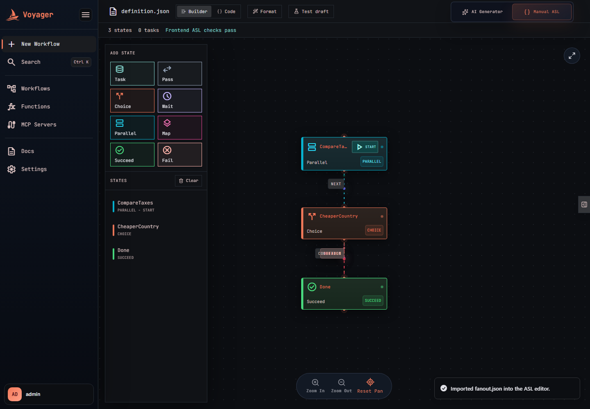
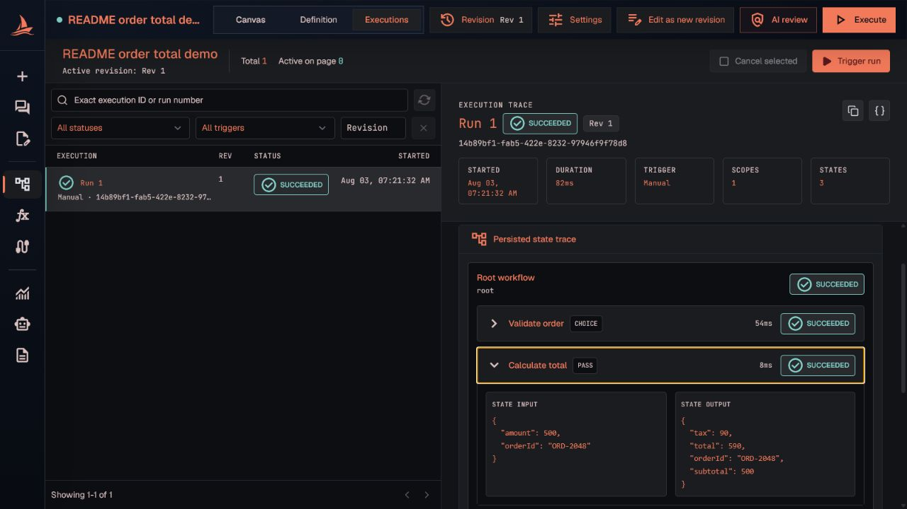
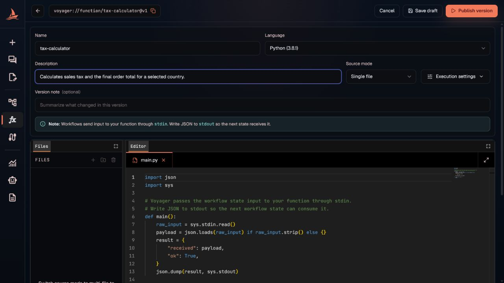
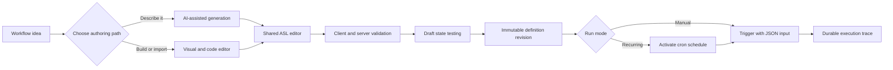
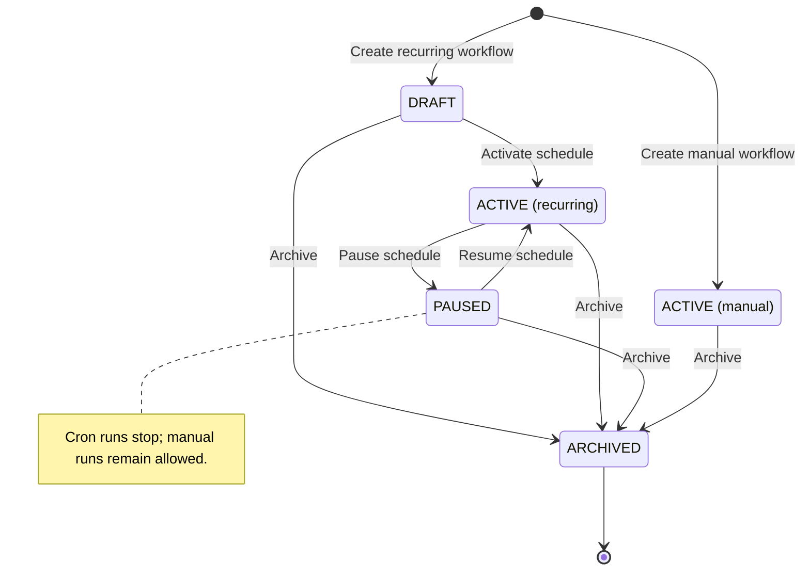
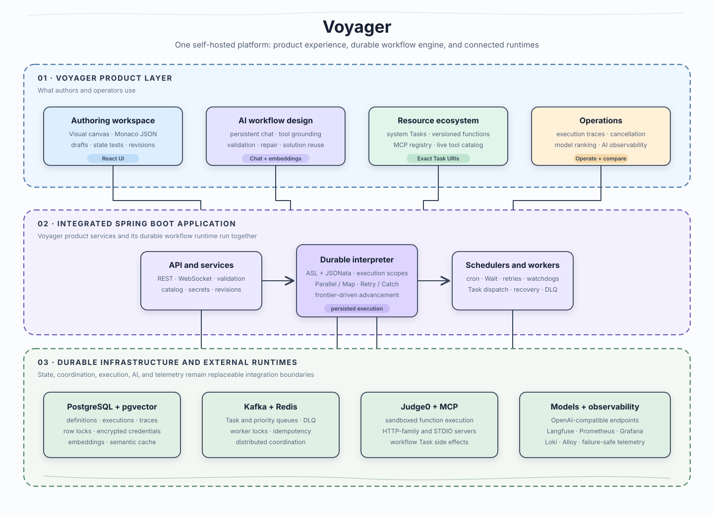
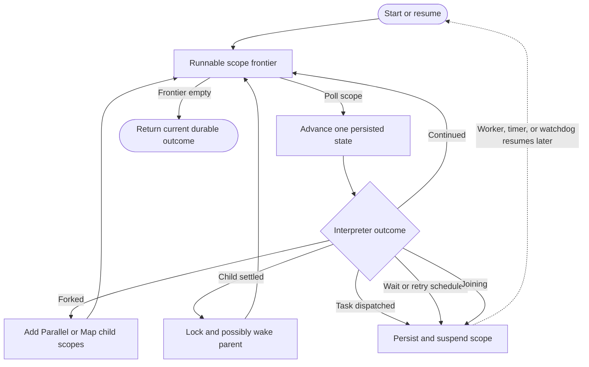
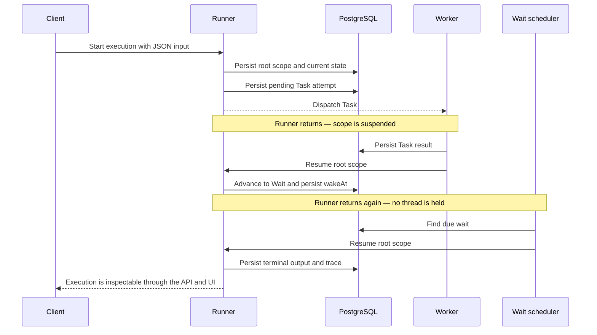
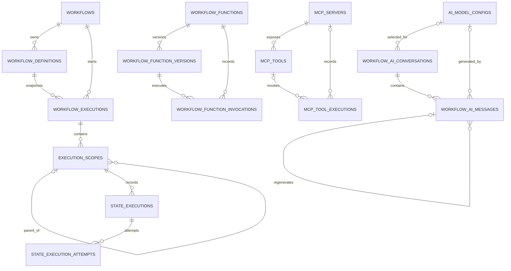

# Voyager

[](https://github.com/harshithrao07/voyager/actions/workflows/ci.yml)


Voyager is a self-hosted workflow automation platform built around durable state machines. Design workflows visually or with AI, connect them to functions and MCP tools, schedule or trigger runs manually, and inspect every execution from a React UI.

Workflow definitions use [Amazon States Language](https://states-language.net/spec.html) with **JSONata exclusively** for conditions and data transformation. The runtime persists execution state in PostgreSQL, so waits, retries, parallel branches, and long-running workflows do not depend on one application process staying alive.



## Contents

- [Why Voyager](#why-voyager)
- [Core concepts](#core-concepts)
- [What Voyager includes](#what-voyager-includes)
- [Architecture](#architecture)
- [Database schema](#database-schema)
- [Getting started](#getting-started)
- [Create your first workflow](#create-your-first-workflow)
- [Configuration](#configuration)
- [API overview](#api-overview)
- [Technology stack](#technology-stack)
- [Repository structure](#repository-structure)
- [Documentation](#documentation)
- [Development](#development)
- [Testing and CI](#testing-and-ci)
- [Current boundaries](#current-boundaries)

## Why Voyager

Many automation tools either hide execution semantics behind a proprietary builder or require workflows to be written as application code. Voyager keeps the workflow itself declarative and inspectable while providing the product surfaces needed to operate it:

- **Visual when you want it, explicit when you need it.** The canvas and JSON editor are two views of the same ASL definition.
- **Durable by construction.** The active cursor, variables, child scopes, attempts, waits, and results are persisted rather than held in one process.
- **AI grounded in real capabilities.** The assistant works against Voyager's current Task catalog instead of freely inventing integrations.
- **Self-hosted integrations.** Functions execute through Judge0, external tools arrive through MCP, and credentials remain under the deployment's master key.
- **Operationally inspectable.** Revisions, execution traces, retries, model benchmarks, metrics, and AI telemetry are first-class UI surfaces.

Voyager grew from the author's original [distributed scheduler](https://github.com/harshithrao07/distributed-scheduler) project.

## Core concepts

| Concept | Meaning in Voyager |
|---|---|
| **Workflow** | Named lifecycle and scheduling metadata pointing to one active definition revision. |
| **Definition revision** | Immutable, canonicalized ASL JSON. Equivalent definitions reuse the same content hash. |
| **Execution** | One manual or scheduled run with JSON input, output, status, and a persisted trace. |
| **Execution scope** | An independently advancing root, Parallel branch, or Map iteration. |
| **Task resource** | An exact URI resolved by Voyager, such as a published function, synced MCP tool, or system integration. |
| **Draft workspace** | Autosaved editor text, canvas positions, settings, and optionally an attached AI conversation. |
| **AI conversation** | Persistent messages and workflow context used to generate, review, and amend a definition. |

## What Voyager includes

### Visual and code-based workflow authoring

- Build workflows on a node canvas or edit their JSON in Monaco.
- Use all eight supported state types: Task, Pass, Choice, Wait, Parallel, Map, Succeed, and Fail.
- Configure JSONata `Arguments`, `Assign`, and `Output`, plus retries, catches, timeouts, and transitions.
- Validate definitions continuously in the browser and again on the server.
- Preview individual draft states before saving; Task previews avoid side effects unless explicitly enabled.
- Import ASL JSON, autosave drafts, and keep immutable, content-addressed definition revisions.

### AI-assisted workflow generation

- Describe a workflow in plain language and refine it through a persistent conversation.
- Use local or cloud OpenAI-compatible chat models, including Ollama, llama.cpp, vLLM, LM Studio, OpenAI, OpenRouter, Groq, and custom compatible endpoints.
- Ground generated Task states against the live Voyager resource catalog.
- Validate and repair generated ASL before it reaches the editor.
- Resume saved chats, retry the latest response, inspect reasoning, and review the workflow before accepting it.
- Compare chat models with deterministic capability tests, reliability runs, and an optional advisory LLM judge.
- Rank embedding models on catalog-retrieval quality independently of chat models.


#### AI across the workflow lifecycle

Beyond initial generation, Voyager's AI capabilities reuse the same catalog, validators, execution
trace, and approval boundaries across the workflow lifecycle:

| Capability | What it does |
|---|---|
| **Scoped authoring assistance** | Explain an existing workflow, repair invalid ASL from deterministic validator output, or request a natural-language change to the selected state without regenerating the whole definition. |
| **Execution intelligence** | Generate an on-demand run report from the persisted scope/state trace, or perform diagnosis-only failure triage grounded in the failing state, input, error, cause, and exact ASL revision. |
| **Qualified integration provisioning** | The assistant can propose missing functions and MCP servers, but users approve every addition. Proposed functions are checked for placeholder secrets, given independently generated tests, executed in Judge0, and published only after qualification succeeds. |
| **Safety before activation** | An explicit AI review flags unguarded destructive tools, possible data exposure, and missing error handling without editing or blocking the workflow. Saving AI-authored workflows with elevated MCP trust requires a separate user confirmation. |

#### AI architecture and techniques

Voyager combines several AI techniques to keep workflow generation grounded, efficient, and
verifiable rather than relying on a single unconstrained model call:

| Technique | How Voyager uses it |
|---|---|
| **Retrieval-augmented generation (RAG)** | Retrieves relevant functions and MCP tools from the live Task-resource catalog with embedding similarity over pgvector, falling back to lexical ranking when embeddings are unavailable. |
| **Tool calling** | For larger catalogs, gives the model bounded, read-only `search_catalog` and `validate_asl` tools instead of placing every resource in the prompt. Providers without tool-calling support fall back to prompt-based grounding. |
| **Semantic caching and solution reuse** | Embeds successful workflow instructions and retrieves a nearby validated solution as an adaptation template. The model regenerates the workflow against the current catalog, and Voyager never serves the cached ASL verbatim without validation. |
| **Structured output** | Uses JSON Schema-constrained responses when supported, with learned per-model fallback through weaker JSON modes to prompt-only generation. |
| **Generate, validate, and repair** | Checks generated ASL, JSONata, runtime capabilities, and exact Task URIs, then feeds validation failures into bounded repair passes before exposing a definition to the editor. |
| **Context compaction** | Keeps recent conversation turns verbatim while replacing older turns with a bounded, source-checked factual summary; the original conversation remains persisted in PostgreSQL. |
| **Model evaluation** | Tests chat models with deterministic capability and reliability cases plus an optional advisory LLM-as-a-judge, while embedding models are ranked separately with retrieval metrics. |
| **Human-in-the-loop provisioning** | Missing integrations can become proposed functions or MCP recommendations, but creation, registration, and activation remain explicit user actions. |

See [AI Workflow Generator](docs/ai-workflows.md) for the generation pipeline, fallback behavior,
guardrails, and configuration details.

### Durable workflow execution

- Run workflows manually with JSON input or on a six-field cron schedule with an IANA timezone.
- Persist executions, scopes, state visits, attempts, input, output, errors, and timing information.
- Execute Parallel branches and Map iterations with isolated scopes and configurable concurrency.
- Suspend Wait states durably and resume them through background schedulers.
- Apply Task retries, exponential backoff, catches, heartbeat timeouts, and workflow-level attempts.
- Cancel active executions cooperatively and inspect the complete execution trace afterward.
- Use PostgreSQL locking, Kafka queues, Redis worker locks, idempotency markers, watchdogs, and a dead-letter queue for distributed coordination.



### Versioned functions

- Write small JavaScript, Python, Java, C, or C++ programs that receive and return JSON.
- Run functions in the bundled Judge0 sandbox.
- Keep draft and published versions, test cases, invocation history, execution limits, and environment configuration.
- Publish enabled versions into the workflow catalog as exact `voyager://function/...` Task resources.



### MCP integrations

- Register HTTP, SSE, streamable HTTP, or STDIO MCP servers.
- Sync discovered tools into Voyager's Task-resource catalog.
- Inspect schemas, invoke tools from a playground, and review execution history.
- Configure bearer, API-key, basic, custom-header, and STDIO environment authentication.
- Store MCP credentials and AI provider keys encrypted with AES-256-GCM.


### Operations and observability

- Inspect workflow status, schedules, revisions, and execution traces from the UI.
- View AI turn volume, tokens, latency percentiles, finish reasons, and per-model traffic.
- Trace AI turns through the bundled self-hosted Langfuse stack.
- Scrape Spring Boot Actuator metrics with Prometheus.
- Open the auto-provisioned Grafana dashboard for application health, HTTP traffic and latency, JVM resources, Kafka consumer lag, and database connection-pool usage.
- Search Compose-container logs from the bundled **Voyager · Logs** Grafana dashboard, which Grafana Alloy populates by discovering containers and forwarding their standard output and error streams to Loki.
- Explore and test the REST API through Swagger UI.

### From idea to execution

Both authoring paths converge on the same editor, validators, revision store, and runtime:



Manual and recurring workflows are shown separately because only a recurring schedule can be paused:



## Architecture

Voyager runs its product services and durable workflow runtime in one Spring Boot application. The
REST and WebSocket APIs, validation, ASL interpreter, schedulers, workers, persistence, and recovery
logic share one deployable backend while external infrastructure remains independently replaceable.



### Deployment topology

The default Docker Compose deployment separates the browser-facing application from its durable
services while keeping workflow coordination inside one Spring Boot codebase:

- **Frontend:** Nginx serves the compiled React application on port `3000`, falls back to
  `index.html` for client-side routes, and proxies `/app`, `/api`, and `/ws` traffic to the backend.
- **Application:** Spring Boot exposes the REST and WebSocket APIs and hosts AI orchestration,
  validation, the ASL interpreter, cron and recovery schedulers, and Kafka Task consumers. In a
  scaled deployment, PostgreSQL locks, Kafka consumer groups, and Redis coordination prevent
  replicas from independently owning the same work.
- **State and coordination:** PostgreSQL is the authoritative store for workflows, immutable
  revisions, executions, scopes, state visits, attempts, credentials, and embeddings. Kafka carries
  asynchronous Task dispatch events, while Redis provides worker locks and idempotency markers.
- **Execution boundaries:** Judge0 runs user-authored functions. Registered MCP servers execute
  external tools. Chat and embedding requests go to the configured local or cloud OpenAI-compatible
  endpoints.
- **Telemetry:** Prometheus scrapes every discoverable application replica, Alloy forwards Compose
  logs to Loki, Grafana queries both stores, and the application emits best-effort AI traces to
  Langfuse.

### Primary data flows

1. **Authoring:** The browser edits a draft or AI conversation, the backend validates the ASL and
   exact Task URIs, and saving creates or reuses an immutable definition revision in PostgreSQL.
2. **Starting a run:** A manual trigger or due cron schedule creates the execution, root scope, and
   initial state record before the frontier runner begins advancing the workflow.
3. **Dispatching a Task:** The interpreter persists the pending attempt and suspends its scope. A
   Kafka consumer invokes the system integration, Judge0 function, or MCP tool, persists the result,
   and resumes the same scope.
4. **Waiting and retrying:** Wait timestamps, retry deadlines, and attempt counters live in
   PostgreSQL. Background schedulers claim due rows and re-enter the same runner; no application
   thread remains blocked while time passes.
5. **Observing:** Execution traces are read from Voyager's persisted hierarchy. Runtime metrics flow
   through Prometheus and Grafana, container logs through Alloy and Loki, and AI-generation spans
   through Langfuse.

### Frontier-driven execution

A scope stays in the in-memory frontier only while it can make immediate progress; all authoritative
state remains in PostgreSQL. The interpreter advances validated, revisioned definitions whose Task
resources resolve through Voyager's system, function, and MCP catalogs.



### Durable suspension and resume

A run can leave the application thread after a Task dispatch or Wait and continue later without carrying in-memory workflow state:



### Failure and recovery model

- **Process restarts:** The active state, scope hierarchy, attempts, and wake times remain in
  PostgreSQL. Recovery schedulers find stale runnable scopes and due work after the application
  returns.
- **Delayed Task delivery:** A Task attempt exists durably before dispatch. Queued-attempt watchdogs
  can make stale work dispatchable again, and consumers re-read persisted attempt state before
  advancing a workflow.
- **Slow or lost workers:** Heartbeat and timeout deadlines are stored with the attempt. Watchdogs
  settle overdue work through the workflow's retry or catch policy instead of leaving the scope
  permanently suspended.
- **Concurrent branches:** Parallel branches and Map iterations use independent execution scopes.
  PostgreSQL row locks serialize child settlement when several branches try to wake the same parent.
- **Optional telemetry outages:** Langfuse export is failure-safe and never blocks an AI turn.
  Prometheus, Grafana, Loki, and Alloy remain outside the workflow correctness path.
- **Cancellation:** Cancellation is cooperative. Voyager prevents later state advancement, but an
  already-running external Task may still complete and its side effects cannot be rolled back.

For the implementation details, see [Interpreter Internals](docs/interpreter.md).

## Database schema

Voyager stores its application state in PostgreSQL 16 with the pgvector extension. The current JPA
entity mappings define 20 application tables. UUIDs are used as primary keys, enums are stored as
readable strings, workflow payloads and structured results use `jsonb`, and timestamps use UTC
instants. The Judge0 and Langfuse services have their own databases and are not part of the Voyager
schema described here.

### Main relationships



`workflows.active_definition_id` points to the revision currently used for new executions. Each
execution also stores its exact `workflow_definition_id`, so activating a later revision never
changes the definition associated with an existing run. `execution_scopes.parent_scope_id` forms a
self-referencing tree for root scopes, Parallel branches, and Map iterations.

Arrows (`→`) in the tables below denote database foreign keys. References explicitly described as
logical IDs are indexed or retained for provenance without a foreign-key constraint.

### Workflow execution tables

| Table | Stores | Important relationships and constraints |
|---|---|---|
| `workflows` | Workflow identity, lifecycle status, cron schedule, timezone, scheduled input, retry limit, and next run time. | Optional `active_definition_id` → `workflow_definitions`; unique `idempotency_key`; optimistic-lock `version`. |
| `workflow_definitions` | Immutable ASL definition revisions, definition hashes, and canvas layouts. | `workflow_id` → `workflows`; unique `(workflow_id, revision)` and `(workflow_id, definition_hash)`. |
| `workflow_executions` | One manual or scheduled run, including definition snapshot, input, output, status, deadline, and error details. | `workflow_id` → `workflows`; `workflow_definition_id` → `workflow_definitions`; unique run number and scheduled time within a workflow. |
| `execution_scopes` | Durable root, Parallel-branch, and Map-iteration cursors, variables, current state, output, and wake time. | `workflow_execution_id` → `workflow_executions`; optional self-reference through `parent_scope_id`; unique `(workflow_execution_id, scope_path)`. |
| `state_executions` | Ordered visits to ASL states with state input/output, resource URI, status, retry time, and errors. | `execution_scope_id` → `execution_scopes`; unique `(execution_scope_id, sequence_number)`. |
| `state_execution_attempts` | Individual Task attempts, dispatch state, worker ownership, arguments/results, heartbeat and timeout deadlines. | `state_execution_id` → `state_executions`; unique `(state_execution_id, attempt_number)`. |

### Function and MCP tables

| Table | Stores | Important relationships and constraints |
|---|---|---|
| `workflow_functions` | Function name, description, status, and active version number. | Unique function name. |
| `workflow_function_versions` | Versioned source, language, Judge0 limits, test cases, and publication status; drafts are mutable while published versions are immutable. | `function_id` → `workflow_functions`; unique `(function_id, version)`. |
| `workflow_function_invocations` | Judge0 submission token, input/output, logs, exit details, duration, and resource usage. | `function_id` and `function_version_id` are foreign keys; `workflow_execution_id` is an optional logical trace reference. |
| `mcp_servers` | Server identity, transport, endpoint or command, trust level, authentication metadata, and encrypted secrets. | Unique stable `server_id`. |
| `mcp_tools` | Discovered tool names, descriptions, JSON input/output schemas, enabled state, and last-seen time. | `mcp_server_id` → `mcp_servers`; unique `(mcp_server_id, tool_name)`. |
| `mcp_tool_executions` | Tool arguments/results, trust limit, status, errors, and timing. | Optional `mcp_server_id` and `mcp_tool_id` foreign keys; stable server/tool names remain for historical inspection. |

### AI and retrieval tables

| Table | Stores | Important relationships and constraints |
|---|---|---|
| `ai_model_configs` | Local/cloud endpoint, model role, encrypted credential, enabled/default flags, structured-output capability, and latest evaluation. | Referenced optionally by conversations and messages. |
| `ai_model_evaluation_runs` | Historical chat-model benchmark mode, progress, result JSON, errors, and timing. | `model_config_id` is a logical model reference, indexed with `started_at`. |
| `embedding_ranking_runs` | Status, timing, errors, and result JSON for each embedding-model leaderboard run. | No foreign keys; one ledger row per ranking run. |
| `workflow_ai_conversations` | Persistent AI/manual workspace, instruction, draft ASL, resource plan, canvas/settings, and compacted summary. | Optional `model_config_id` → `ai_model_configs`; workflow and summary-message IDs are logical references. |
| `workflow_ai_messages` | Conversation turns, structured payloads, reasoning, token usage, latency, finish reason, and metadata. | `conversation_id` → `workflow_ai_conversations`; optional model FK and self-reference through `regenerated_from_message_id`. |
| `resource_embeddings` | One pgvector embedding for each function or MCP tool plus model, dimensions, and source hash. | Unique polymorphic `(resource_type, resource_id)` logical reference. |
| `resource_eval_queries` | Retrieval-evaluation query generated for each catalog resource. | Unique polymorphic `(resource_type, resource_id)` logical reference. |
| `workflow_solution_embeddings` | Validated workflow solutions used as semantic adaptation templates. | Unique logical `source_conversation_id`; optional logical `source_workflow_id`. |

The two embedding tables use fixed-width `vector(4000)` columns; shorter native vectors are
zero-padded while the original dimension is retained. JSON payloads remain queryable as `jsonb`,
while credentials are encrypted with AES-256-GCM before their ciphertext reaches PostgreSQL.

### Schema lifecycle

- `docker/postgres-init/00-pgvector.sql` enables pgvector when a fresh Compose volume is created.
- The local profile uses `spring.jpa.hibernate.ddl-auto=update` for development convenience.
- Tests create a fresh schema with `ddl-auto=create`.
- The production profile uses `ddl-auto=validate`; it expects a compatible schema to be provisioned
  before startup. The repository currently does not include a Flyway or Liquibase migration chain.

The entity classes under `src/main/java/com/job/scheduler/entity` are the authoritative table and
constraint definitions. See [Interpreter Internals](docs/interpreter.md) for how the execution
tables are locked and advanced at runtime.

## Getting started

### Requirements

- Docker with Docker Compose
- OpenSSL, or another way to generate 32 cryptographically random bytes encoded as Base64

Clone the repository:

```bash
git clone https://github.com/harshithrao07/voyager.git
cd voyager
```

Generate the deployment master key:

```bash
openssl rand -base64 32
```

Create a git-ignored `.env` file and save the generated value:

```dotenv
SCHEDULER_SECRETS_MASTER_KEY=<generated-base64-value>
```

Start the stack:

```bash
docker compose up --build -d
```

Voyager intentionally refuses to start without a valid 32-byte master key. The key encrypts AI-provider and MCP credentials stored in PostgreSQL. Back it up securely; losing it makes those encrypted values unrecoverable.

Open [http://localhost:3000](http://localhost:3000) when the containers are healthy.

### Local URLs

| Service | URL | Purpose |
|---|---|---|
| Voyager UI | `http://localhost:3000` | Workflow authoring and operations |
| API | `http://localhost:8081/app/v1` | REST API base path |
| Swagger UI | `http://localhost:8081/swagger-ui.html` | Interactive API documentation |
| Health | `http://localhost:8081/actuator/health` | Application health |
| Prometheus | `http://localhost:9090` | Metrics server |
| Grafana | `http://localhost:3300` | Pre-provisioned Voyager runtime dashboard |
| Langfuse | `http://localhost:3100` | AI trace inspection |

The default Compose stack includes the frontend, backend, PostgreSQL, Kafka, Redis, Judge0 server and worker, Prometheus, Grafana, Loki, Alloy, and Langfuse with its backing services. Grafana starts with Prometheus and Loki already configured as datasources and both the bundled **Voyager · Spring Boot runtime** dashboard (selected as its home dashboard) and the **Voyager · Logs** dashboard provisioned. Loki is internal and has no separate UI; its logs are searched from the **Voyager · Logs** dashboard inside Grafana. Compose enables anonymous Grafana admin access for frictionless local development; disable or restrict it before exposing Grafana beyond a trusted machine. The frontend becomes available only after its required dependencies and backend readiness probe are healthy.

An optional deterministic MCP fixture is available for local development:

```bash
docker compose --profile demo-mcp up -d demo-mcp
```

Stop the stack with:

```bash
docker compose down
```

Add `-v` only when you intentionally want to remove the local databases, Kafka logs, Redis data, and other named volumes.

## Create your first workflow

After opening `http://localhost:3000`, choose either authoring path:

### AI-assisted path

1. Open **New Workflow** and keep **AI Generator** selected.
2. Add or select an enabled chat model. For a model server running on the Docker host, use `host.docker.internal` rather than `localhost` in its base URL.
3. Describe the behavior, including the external systems, failure handling, and whether it needs a schedule.
4. Review the generated resource plan and ASL. Voyager validates catalog URIs and the definition before placing it in the editor.
5. Continue the conversation or edit the canvas/JSON directly.
6. Test important states, configure workflow settings, and save.

### Manual path

1. Switch to **Manual ASL**, import a JSON definition, or add the first state from the palette.
2. Select a Task resource from the live picker instead of typing an unregistered URI.
3. Configure data flow with JSONata and connect state transitions.
4. Resolve the issues shown by live validation.
5. Use **Test draft** to preview states. Task side effects remain disabled unless you explicitly allow them.
6. Save the workflow. Manual workflows become active immediately; recurring workflows must have their schedule activated.

### Run and inspect it

Open the saved workflow and select **Trigger run** to provide JSON input. The execution page shows its live status and persisted hierarchy of scopes, state visits, and Task attempts. Active executions can be cancelled cooperatively; already-started external side effects cannot be rolled back.

### Minimal ASL example

Voyager's dialect uses JSONata expressions delimited by `` and omits `QueryLanguage` because JSONata is implicit:

```json
{
  "StartAt": "Prepare",
  "States": {
    "Prepare": {
      "Type": "Pass",
      "Output": {
        "message": ""
      },
      "Next": "Done"
    },
    "Done": {
      "Type": "Succeed"
    }
  }
}
```

See [ASL with JSONata](docs/asl-jsonata.md) for supported fields, state semantics, data flow, error handling, and runtime constraints.

## Configuration

Docker Compose provides working local defaults for infrastructure. Put secret or deployment-specific overrides in `.env`; do not commit that file.

### Common environment variables

| Variable | Required | Compose default | Purpose |
|---|---:|---|---|
| `SCHEDULER_SECRETS_MASTER_KEY` | Yes | None | Base64-encoded 32-byte key used to encrypt stored credentials. |
| `OLLAMA_OPENAI_BASE_URL` | No | `http://host.docker.internal:11434/v1` | Default local OpenAI-compatible endpoint. |
| `OLLAMA_OPENAI_API_KEY` | No | `ollama` | Credential sent to the default local endpoint. |
| `OLLAMA_MODEL` | No | `qwen3:8b` | Initial local chat-model identifier. |
| `SCHEDULER_WORKER_ID` | No | `worker-${HOSTNAME}` | Identity used by the workflow worker. |
| `JUDGE0_BASE_URL` | No | `http://judge0-server:2358` | Judge0 API used for function execution. |
| `JUDGE0_AUTH_TOKEN` | No | Empty | Optional Judge0 authentication token. |
| `JUDGE0_DEFAULT_MEMORY_LIMIT_KB` | No | `4194304` | Default per-function virtual memory ceiling. |
| `LANGFUSE_TRACING_ENABLED` | No | `true` in Compose | Enables best-effort AI turn tracing. |
| `LANGFUSE_HOST` | No | `http://langfuse-web:3000` | Langfuse endpoint inside the Compose network. |
| `LANGFUSE_INIT_USER_EMAIL` | No | `admin@voyager.local` | Initial local Langfuse account. |
| `LANGFUSE_INIT_USER_PASSWORD` | No | `voyager-admin` | Initial local Langfuse password; override outside throwaway development. |
| `GRAFANA_ROOT_URL` | No | `http://localhost:3300` | Public URL used by the bundled Grafana service. |
| `GRAFANA_ADMIN_USER` | No | `admin` | Grafana administrator username. |
| `GRAFANA_ADMIN_PASSWORD` | No | `admin` | Grafana administrator password; override outside throwaway development. |

Important tuning controls are also exposed as environment variables:

- `WORKFLOW_AI_TOOL_CALLING_ENABLED` and `WORKFLOW_AI_TOOL_CALLING_MIN_CATALOG_SIZE`
- `WORKFLOW_AI_EMBEDDING_ENABLED`, `WORKFLOW_AI_EMBEDDING_TOP_K`, and `WORKFLOW_AI_EMBEDDING_MIN_CATALOG_SIZE`
- `WORKFLOW_AI_SOLUTION_CACHE_ENABLED` and `WORKFLOW_AI_SOLUTION_CACHE_ADAPT_MAX_DISTANCE`
- `WORKFLOW_AI_MAX_CONTEXT_TOKENS`, `WORKFLOW_AI_RECENT_CONTEXT_TOKENS`, and `WORKFLOW_AI_SUMMARY_MAX_CHARACTERS`
- `JUDGE0_ALLOWED_LANGUAGE_IDS` and `JUDGE0_AI_DEFAULT_LANGUAGE_ID`

Defaults and lower-level scheduler limits are documented alongside their implementation in [`application.properties`](src/main/resources/application.properties). Credential behavior is covered in [Secrets](docs/secrets.md).

## API overview

The UI uses the same `/app/v1` API available to external clients. Swagger UI documents the complete request and response schemas; these are the main resource groups:

| Base path | Examples |
|---|---|
| `/app/v1/workflows` | Create/list workflows, add and activate revisions, trigger/list/cancel executions, pause, resume, and archive. |
| `/app/v1/functions` | Manage functions and versions, publish a version, run tests, and inspect invocations. |
| `/app/v1/mcp/servers` | Register servers, enable/disable them, sync tools, call a tool, and inspect executions. |
| `/app/v1/ai/models` | Register, discover, enable, rank, and evaluate chat or embedding models. |
| `/app/v1/ai/observability` | Read persisted AI activity and latency metrics. |

Example: list workflows after starting the local stack:

```bash
curl http://localhost:8081/app/v1/workflows
```

See `http://localhost:8081/swagger-ui.html` for the authoritative endpoint catalog.

## Technology stack

| Area | Technology |
|---|---|
| Backend | Java 17, Spring Boot 4, Spring Data JPA, Spring Kafka, Spring WebSocket |
| Frontend | React 19, TypeScript, Vite, Tailwind CSS, React Flow, Monaco Editor |
| Workflow language | Amazon States Language structure with Voyager's JSONata-only data dialect |
| Persistence | PostgreSQL with pgvector |
| Distributed coordination | Kafka and Redis |
| Function runtime | Judge0 |
| AI providers | Local or cloud OpenAI-compatible chat and embedding endpoints |
| External tools | Model Context Protocol servers over HTTP-family transports or STDIO |
| Observability | Spring Boot Actuator, Prometheus, Grafana, Loki, Alloy, native AI metrics, Langfuse |
| Local packaging | Docker Compose and Nginx |

## Repository structure

```text
voyager/
├── src/main/java/com/job/scheduler/   Spring Boot API, services, runtime, workers
├── src/main/resources/                Configuration and stable AI evaluation suite
├── src/test/                          Unit and Testcontainers integration tests
├── frontend/src/                      React application
├── frontend/tests/                    Frontend validation and Playwright tests
├── docs/                              In-app and repository documentation
├── docker/                            Grafana provisioning and Alloy log-collection configuration
├── bench/                             Workflow-AI benchmark runner
├── scripts/                           Development, MCP fixture, and CI utilities
├── docker-compose.yml                 Complete self-hosted development stack
├── Dockerfile                         Backend image
└── frontend/Dockerfile                Frontend image
```

## Documentation

The same guides are available from **Docs** inside Voyager:

| Guide | Covers |
|---|---|
| [Workflows](docs/workflows.md) | Authoring, revisions, scheduling, testing, and executions |
| [AI Workflow Generator](docs/ai-workflows.md) | Persistent AI conversations, grounding, validation, and repair |
| [AI Models](docs/ai-models.md) | Local/cloud models, discovery, defaults, and ranking |
| [Functions](docs/functions.md) | Judge0 functions, versions, tests, limits, and invocation history |
| [MCP Servers](docs/mcp.md) | Server registration, tool sync, authentication, and playground |
| [ASL with JSONata](docs/asl-jsonata.md) | Voyager's state-machine dialect |
| [Interpreter Internals](docs/interpreter.md) | Runtime, scopes, persistence, and locking |
| [Secrets](docs/secrets.md) | Credential encryption and master-key operation |
| [AI Observability](docs/observability.md) | Native AI telemetry, Grafana metrics and logs, and Langfuse tracing |

## Development

### Backend

The backend requires Java 17. Integration tests use Testcontainers, so Docker must be running:

```bash
./mvnw test
```

On Windows:

```powershell
.\mvnw.cmd test
```

### Frontend

The frontend uses React, TypeScript, and Vite:

```bash
cd frontend
npm install
npm run build
```

Useful checks:

```bash
npm run lint
npm run test:asl
npm run test:e2e
```

## Testing and CI

GitHub Actions builds and tests the backend and frontend. On `main`, CI publishes the application and frontend container images to GHCR with `latest` and immutable commit tags. JaCoCo and Surefire reports are uploaded for inspection, and Sonar analysis runs when its repository credentials are configured.

JaCoCo writes HTML coverage to `target/site/jacoco/index.html`. The section below is regenerated by `scripts/update-coverage-readme.py` after the backend test suite runs in CI.

### Coverage

<!-- COVERAGE-START -->

Latest JaCoCo run across the full Testcontainers-backed suite:

| Metric | Covered | Total | Coverage |
|---|---:|---:|---:|
| Instructions | 40,873 | 52,531 | 78% |
| Branches | 3,737 | 6,016 | 62% |
| Lines | 8,914 | 11,503 | 77% |
| Methods | 1,399 | 1,703 | 82% |
| Classes | 320 | 346 | 92% |

Per-package instruction coverage:

| Package | Coverage |
|---|---:|
| `consumers` | 100% |
| `com.job.scheduler.entity` | 100% |
| `enums` | 100% |
| `monitoring` | 100% |
| `producers` | 100% |
| `utility` | 100% |
| `com.job.scheduler.workflow.asl.validation` | 94% |
| `handlers` | 93% |
| `com.job.scheduler.workflow.task` | 91% |
| `exception` | 89% |
| `dto` | 89% |
| `dto.payload` | 89% |
| `scheduler` (due-job, watchdogs, DLQ) | 89% |
| `com.job.scheduler.workflow.asl.runtime` | 87% |
| `com.job.scheduler.entity.converter` | 86% |
| `controller` | 82% |
| `service` (job lifecycle, worker, locks) | 72% |
| `config` | 66% |
| `com.job.scheduler` (root) | 38% |

Open `target/site/jacoco/index.html` after `mvn test` for the drill-down view.

<!-- COVERAGE-END -->

## Current boundaries

Voyager is under active development, but the README intentionally describes only working behavior. Important current boundaries are:

- Voyager uses its **JSONata-only ASL dialect**. JSONPath fields such as `Parameters`, `ResultPath`, and `OutputPath` are rejected.
- Draft testing supports simple states and Task preview/invocation; Parallel and Map draft previews are not implemented.
- Workflow starts are manual or cron-based. The cron format has six fields with seconds first.
- Cancellation is cooperative. An external Task that already started may finish, and Voyager cannot undo its side effects.
- AI endpoints must expose the OpenAI-compatible operations needed by their role. Voyager falls back when optional streaming, structured-output, or tool-calling features are rejected, but it cannot adapt to an unrelated provider API.
- Embedding vectors must fit Voyager's fixed maximum dimension of 4,000; shorter vectors are zero-padded.
- Function language availability follows the connected Judge0 catalog and Voyager's runtime policy.
- The repository targets self-hosted Docker Compose operation. CI publishes container images, but no hosted Voyager service or automated deployment target is provided.
