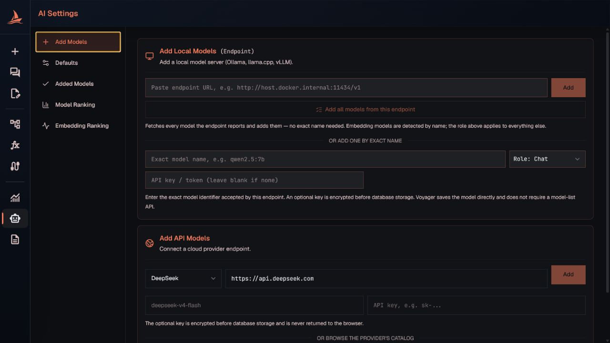
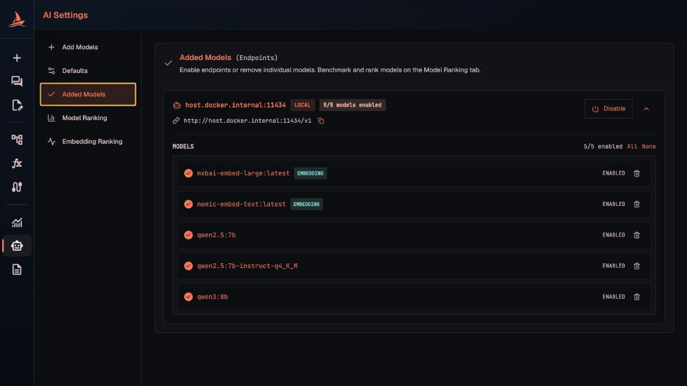
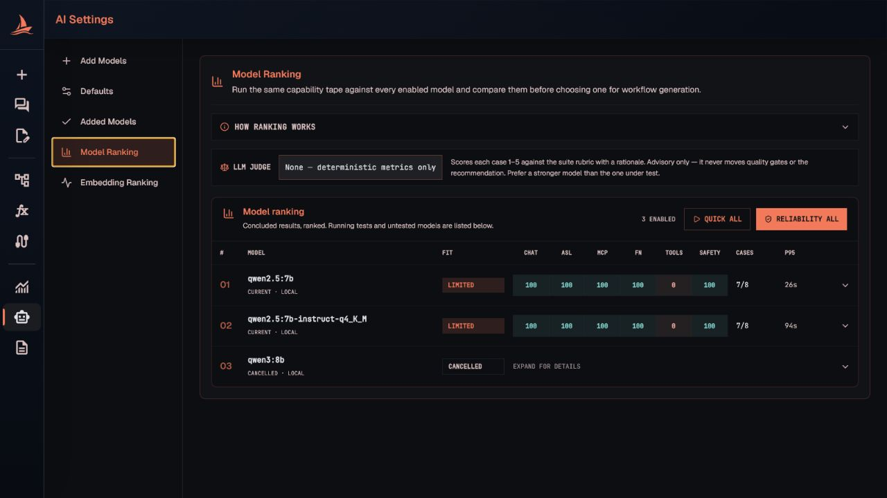
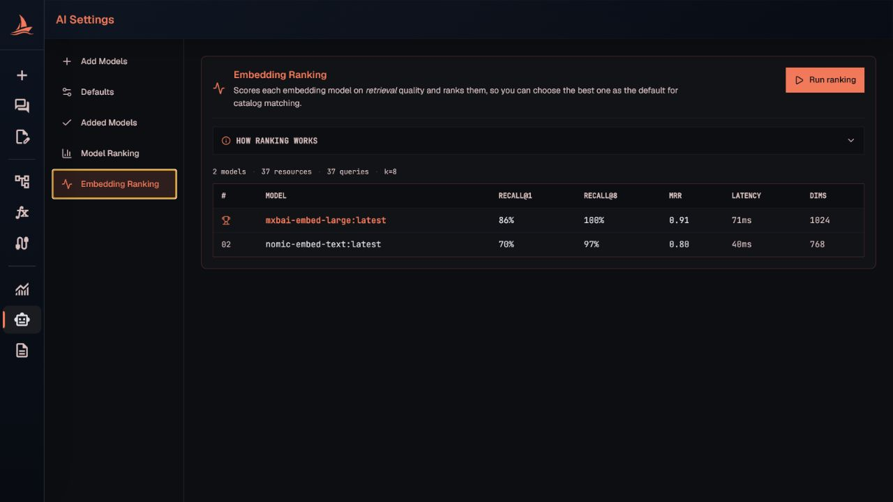

# AI Models

Voyager talks to any OpenAI-compatible model — local servers you run yourself and hosted cloud
providers. Models are managed on the **AI Settings** page in the sidebar (`/ai-settings`, directly
below [Observability](observability.md)). The same surface is reachable from the model picker inside
the AI workflow composer, so a model added in either place shows up in both.

- [Roles: chat and embedding](#roles-chat-and-embedding)
- [Add local models](#add-local-models)
- [Add cloud models](#add-cloud-models)
- [Discover a provider's catalog](#discover-a-providers-catalog)
- [Defaults](#defaults)
- [Added models](#added-models)
- [Model ranking](#model-ranking)
- [Embedding ranking](#embedding-ranking)
- [HTTP API](#http-api)

## Roles: chat and embedding

Every model has one role:

| Role | Used for |
|---|---|
| **Chat** | Workflow authoring, the pre-activation AI review, failure triage, and generated catalog descriptions. |
| **Embedding** | Indexing and retrieving relevant functions and MCP tools for the resource catalog. |

Each role has its own default (see [Defaults](#defaults)). Embedding models never appear in the chat
model picker and cannot run the chat benchmark, so they are excluded from [Model ranking](#model-ranking)
and the judge picker — they are ranked separately under [Embedding ranking](#embedding-ranking).

The embedding vector column is a fixed width with zero-padding, so any embedding model whose dimension
fits works with no recompile. Switching embedding models changes what a stored vector means; re-index
after a change. See [Secrets](secrets.md) for how credentials are stored.

## Add local models

Under **Add Models → Add Local Models**, enter the API base URL and, to add a single model, its exact
model identifier and role, then select **Add**. An optional API key or token is encrypted before
database storage and never returned to the browser.

Use `host.docker.internal`, not `localhost`, when the Voyager backend runs in Docker and the model
server runs on the host. Voyager warns when a `localhost`/`127.0.0.1` endpoint is entered because that
address resolves inside the backend container, not on your host.

This flow works for Ollama, llama.cpp, vLLM, LM Studio, and other OpenAI-compatible servers.

## Add cloud models

Under **Add Models → Add API Models**, choose a provider preset (DeepSeek, OpenAI, OpenRouter, Groq,
or **Custom**), verify the endpoint, enter the exact model name, paste the API key, and select **Add**.
The key is the actual secret value, not a reference; it is encrypted at rest and never returned to the
browser.

## Discover a provider's catalog

Instead of typing model names one at a time, Voyager can read an endpoint's `/models` listing and add
the models for you. This works with any provider that exposes the OpenAI-style listing (Ollama and
other local servers, DeepSeek, OpenAI, OpenRouter, Groq). Providers with a different listing format,
such as Google Gemini's native API, are not discoverable and must be added by exact name.

**Roles are detected automatically.** During discovery, models whose name identifies an embedding
family — anything containing `embed`, plus `bge` / `gte` / `e5` / `minilm` / `paraphrase-` variants —
are onboarded as **Embedding**; everything else takes the role you selected (Chat by default). A model
with an unusual name that is missed can have its role corrected afterward.

### Local: add every model

Under **Add Local Models**, enter the endpoint and select **Add all models from this endpoint**. No
key is required for a typical local server. Voyager lists the endpoint's models and adds all of them at
once, applying automatic role detection. This suits local servers, which usually host only a handful
of pulled models.

### Cloud: discover and pick

Under **Add API Models**, enter the endpoint and the **API key** (cloud providers require it to list
models), then select **Discover models…**. Voyager fetches the provider's catalog and opens a picker
where you:

- filter the list by name;
- select all matching models or choose individually; and
- see already-added models marked and disabled so you only add new ones.

Selecting **Add** onboards just your selection. Picking rather than adding all matters for large
catalogs — OpenRouter lists hundreds of models, and OpenAI's includes embeddings, audio, and
moderation models you would not want in your chat picker.

If the provider rejects the request, the dialog reports it. `HTTP 401`/`403` means the API key was
missing or wrong; re-check the key and retry.

## Defaults

The **Defaults** tab picks which enabled model Voyager uses by default for each role — one **Chat**
model and one **Embedding** model. The first model added for a role automatically becomes that role's
default; the backend also backfills a default whenever a role has enabled models but none is marked.

## Added models

The **Added Models** tab groups models by endpoint. From there you can:

- enable or disable every model behind an endpoint, or one model at a time;
- copy the endpoint URL;
- set a model as its role's default; or
- delete individual models (other models on the same endpoint stay).

Disabled models remain in the registry but do not appear in the chat picker or run benchmarks. An
**Encrypted key** badge means the endpoint has a stored credential; the value is never revealed. An
**Embedding** badge marks embedding-role models.

## Model ranking

The **Model Ranking** tab runs the shared `workflow-ai-v1` capability suite against every enabled chat
model so you can compare them before choosing one for workflow generation.

- **Quick test** runs one pass; **Reliability** runs three passes for a stability signal.
- An optional **LLM judge** scores each case 1–5 against the suite rubric with a rationale. It is
  advisory only — it never moves the quality gates or the recommendation. Prefer a stronger model than
  the one under test.
- Results stream per case while a run is in progress, and each model keeps a test history you can
  reopen.
- Cloud models (or a cloud judge) prompt for confirmation first, because every generation and repair
  call may be billed by the provider.

## Embedding ranking

The **Embedding Ranking** tab benchmarks embedding models on the retrieval task they actually serve —
ranking relevant functions and MCP tools for the catalog — so you can pick the best embedding model
independently of the chat models.

## HTTP API

Base path: `/app/v1/ai`

| Method and path | Purpose |
|---|---|
| `GET /models` | List enabled chat models shown in the composer. |
| `GET /models/all` | List enabled and disabled models for the settings page. |
| `POST /models` | Add one model with an optional write-only `credential`. |
| `POST /models/available` | List the models a provider reports at `/models` without adding them (the discover-and-pick read step). Returns each model with an `alreadyAdded` flag. |
| `POST /models/discover` | Onboard models from an endpoint. Adds every reported model, or only the `modelNames` supplied. Roles are auto-detected. |
| `POST /models/test` | Optional OpenAI-style model-list reachability probe. |
| `PATCH` or `POST /models/{id}/enabled` | Enable or disable one model. |
| `PATCH` or `POST /models/{id}/default` | Make one model its role's default. |
| `DELETE /models/{id}` | Remove one model configuration. |
| `GET /models/evaluations/latest` | Latest benchmark result per model. |
| `POST /models/{id}/evaluations` | Start a `QUICK` or `RELIABILITY` benchmark, with an optional judge model. |
| `GET /models/{id}/evaluations` | Paged benchmark history for one model. |
| `POST /models/{id}/evaluations/{runId}/cancel` | Cancel a running benchmark. |
| `POST /embeddings/ranking` | Start an embedding-model ranking run. |
| `GET /embeddings/ranking/latest` | Latest embedding ranking result. |

Credentials sent to these endpoints are the actual secret values. Voyager encrypts them before
database storage and never returns them — see [Secrets](secrets.md).
