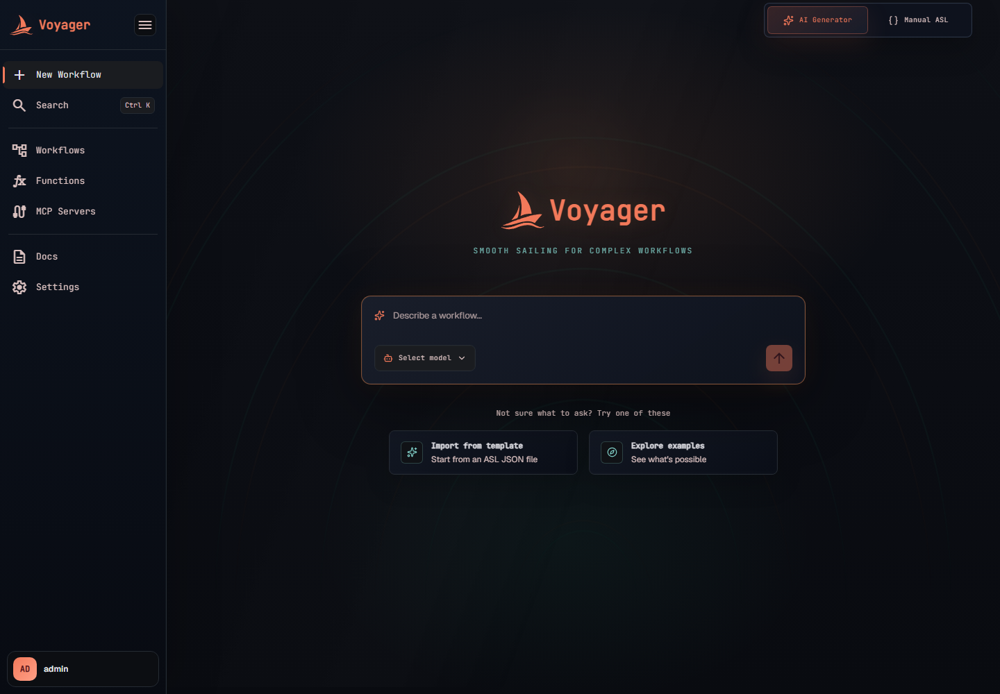

# AI Workflow Generator

Voyager's AI generator is a persistent workflow-design conversation, not a one-shot text box. It
combines an OpenAI-compatible model with the current ASL editor, the workflow settings, and a live
catalog of Voyager Task resources. Each conversation can be reopened later at `/c/<conversationId>`
with its messages, generated JSON, canvas positions, and settings restored.



- [Configure a model](#configure-a-model)
- [Start and resume conversations](#start-and-resume-conversations)
- [What the assistant can use](#what-the-assistant-can-use)
- [Conversation context and summarization](#conversation-context-and-summarization)
- [Retrying a response](#retrying-a-response)
- [Workspace persistence](#workspace-persistence)
- [Review and accept the workflow](#review-and-accept-the-workflow)
- [HTTP and WebSocket API](#http-and-websocket-api)
- [Operator configuration](#operator-configuration)

## Configure a model

Open the model picker in the composer and select **+** to open **Settings**. Voyager supports two
families of OpenAI-compatible endpoints:

| Family | Intended use | Examples |
|---|---|---|
| **Local endpoint** | Models reachable from the Voyager backend | Ollama, llama.cpp, vLLM, LM Studio |
| **Cloud provider endpoint** | Hosted OpenAI-compatible APIs | DeepSeek, OpenAI, OpenRouter, Groq, Custom |

### Local endpoints

Under **Add Local Models**, enter the API base URL, the exact model identifier accepted by the
server, and an optional API key or token, then select **Add**. Voyager registers that one model
directly. It does not assume the server implements a model-list endpoint, so the same flow works for
Ollama, llama.cpp, vLLM, LM Studio, and other OpenAI-compatible servers.

Use `host.docker.internal`, not `localhost`, when the backend runs in Docker and the model server
runs on the host.

### Cloud endpoints

Under **Add API Models**, choose a provider preset, verify the endpoint, enter the exact model name,
paste the optional API key, and select **Add**. Registration does not call `/models`; this supports
providers such as Cloudflare whose OpenAI-compatible inference endpoint does not expose that route.

The API key field contains the actual value. It is not a secret name or reference. Voyager encrypts
the value before database storage and never returns it to the browser. See [Secrets](secrets.md).

### Added models

The **Added Models** tab groups models by endpoint. From there you can:

- enable or disable all models behind an endpoint;
- enable or disable one model;
- copy the endpoint URL; or
- delete the registered endpoint models.

Disabled models stay in the registry but do not appear in the chat model picker. An **Encrypted
key** badge means the endpoint has a stored credential; it never reveals the value.

## Start and resume conversations

Enter an instruction such as "Fetch the customer, reserve inventory, and send a webhook on
failure." The first successful turn creates a conversation and replaces the create URL with:

```text
/c/<conversationId>
```

The ASL opens in the manual builder and the conversation continues in the editor's AI sidebar.
Every later prompt includes the current valid editor definition, so the assistant amends the open
workflow instead of starting from a blank state.

Manual-first workspaces use the same editor and persistence behavior with a different canonical URL.
Selecting **Manual ASL** only opens the editor; it does not create an empty draft. Adding the first
state (including by importing or entering a definition that contains states) creates the durable
workspace at `/draft/<draftId>`. From that point, its exact definition buffer, canvas, and settings
autosave immediately. If AI is opened later, the conversation attaches to that same draft row and
the URL remains `/draft/<draftId>`; no second `/c/<conversationId>` is created. The draft receives a
model only when its first AI prompt is sent.

The main sidebar's **Chats** section lists previous conversations, newest meaningful update first.
Search matches the conversation title, initial instruction, or model name. Selecting a chat restores
it without changing its `updatedAt`; simply viewing an old conversation does not move it to the top.
A real message or workspace edit does update it.

The **Drafts** section directly below Chats provides the same list controls for manual-first
workspaces: newest-first ordering, search, reopen, rename, delete one, and delete all. Chats can also
be renamed from their sidebar row. A custom name is stored separately from the generated chat title
or workflow settings, survives refresh, and is included in sidebar search. Saving a manual draft as
a workflow links the draft to that workflow and opens `/workflows/<workflowId>`. The draft remains
available so it can be reopened later to create further workflow revisions.

Each persisted user message and completed assistant response displays its own date and time. The
temporary **Thinking...** row has no timestamp. If the model returns reasoning, it appears inside the
assistant response as an expandable **Reasoning** section and does not become a separate message.

## What the assistant can use

Every turn receives a fresh catalog of resources that exist in Voyager at that moment:

- `voyager://system/webhook`, including `method`, `headers`, and `body` arguments;
- `voyager://system/send-email`;
- every enabled function that has an active published version, pinned as
  `voyager://function/<name>@vN`; and
- every enabled tool synced from an enabled MCP server, using the exact
  `voyager://mcp/<server>/<tool>` URI and required `?trust=WRITE` or `?trust=DESTRUCTIVE` grant.

The resource catalog includes function descriptions and MCP tool argument schemas. A matching real
resource is mandatory: the assistant is instructed not to replace an available Task with a Pass
state or invent an unregistered URI. Save-time validation still checks every generated function and
MCP reference before the workflow can be saved or activated.

When a capability is missing, the assistant enters `RESOURCES_PROPOSED`. The **Resources needed
first** card is stored and rendered as an attachment on the assistant message that proposed it; it
is not a floating chat-level panel. Creating the proposed functions or selecting **I've attached it
— continue** resumes that same proposal without adding a synthetic user message. Voyager re-reads
the live registry, matches capability descriptions and provider/server suggestions to exact synced
MCP tool URIs, and tells the model not to propose capabilities that are already available. If the
remaining proposal changes, the original message attachment remains immutable while the
conversation-level active plan stores only the unresolved subset. The UI compares those two plans
and marks individual functions and MCP requirements completed, including after a refresh.
Completed or superseded proposals remain visible as read-only conversation history. Older chats
whose attachment metadata was overwritten are recovered from the original structured AI response.
A model response that fails validation is retained as a diagnostic chat message, but its rejected
resource payload is never published as a new card or allowed to replace the last accepted proposal.

AI-proposed function names are canonicalized before display and approval. Camel case and snake case
inputs such as `shortenAndTitleCase` or `shorten_and_title_case` become the registry-safe kebab-case
name `shorten-and-title-case`; the approval endpoint applies the same normalization for stale tabs.

Function-authoring instructions are conditional. The normal workflow prompt contains only enough
information to decide whether a missing capability is deterministic local logic (a function) or an
external/network capability (an MCP requirement). It does not receive the supported-language list,
function naming syntax, source-code contract, JSON stdin/stdout rules, or test-case rules. If and
only if the first response actually proposes a function, Voyager makes a function-review pass with
those rules and the live supported-language list before validating or showing the proposal. The
same conditional review runs when an automatic repair introduces a function. This prevents
function-only guidance from distracting ASL-only and MCP-only workflow turns.

The conversation moves through these durable stages:

```text
COLLECTING_WORKFLOW_DETAILS
  -> RESOURCES_PROPOSED (when functions or MCP tools are missing)
  -> ASL_READY / ASL_UNDER_REVIEW
  -> COLLECTING_SCHEDULE_DETAILS
  -> PLAN_READY
  -> ACCEPTED
```

An invalid candidate can remain visible for correction, but it does not overwrite the last valid,
authoritative ASL saved for the conversation.

## Conversation context and summarization

Voyager stores both sides of the conversation: user messages, assistant responses, optional model
reasoning, model and token metadata, and regeneration links. It does not discard old messages after
summarization.

For a short conversation, the next model request includes all effective user and assistant turns.
When the estimated prompt would exceed the configured context budget, Voyager:

1. keeps the most recent turns verbatim;
2. rebuilds a bounded factual summary from the complete older source prefix;
3. records which persisted message that summary covers; and
4. sends the summary plus the recent turns on later requests.

Summaries are prompt compression only. The original rows remain authoritative in PostgreSQL and are
still returned when the conversation is reopened. Generated summaries are checked against source
anchors; an ungrounded summary is discarded and rebuilt. If the summary model call fails or returns
an unusable result, a deterministic bounded fallback keeps the conversation usable.

The following durable context is supplied independently of chat compaction on every turn:

- the initial request and current stage;
- the latest valid ASL definition;
- the latest final plan;
- the current workflow name, schedule, timezone, attempts, and idempotency key; and
- the current Task-resource catalog.

Distinctive source identifiers are also carried verbatim within a bounded identifier list. This
helps preserve exact function names, MCP URIs, headers, and other tokens through a long discussion.

## Retrying a response

**Retry** is available only under the latest persisted assistant response. Both the UI and backend
enforce this rule; an older reply cannot be regenerated after newer turns have been added.

Regeneration appends a new assistant message linked to the response it replaces. The superseded
reply is hidden from the visible and effective conversation history. Repeated retries always anchor
on the first attempt's preceding history, so discarded replies do not accumulate in the next prompt
and cause response drift.

## Workspace persistence

One AI conversation stores more than its messages:

| Stored data | Restore behavior |
|---|---|
| Exact definition editor text | Reopens exactly as last typed, including an incomplete edit |
| Latest valid ASL | Remains the authoritative definition used by the assistant and workflow creation |
| Draft workflow payload and final plan | Restores the latest generated plan |
| Canvas layout | Restores moved nodes at their saved positions |
| Name, maximum attempts, cron, timezone, idempotency key | Restores the workflow settings |
| Selected model | Restores the model used by the conversation |
| Created workflow ID | Makes later saves from the same `/c/<id>` or `/draft/<id>` create revisions of that workflow |

After a conversation has been created, definition text and the rest of the workspace autosave after
a 400 ms pause. Voyager saves the exact editor buffer even while the JSON is incomplete or the ASL
has validation errors, so a refresh does not discard work in progress. That raw buffer is stored
separately from the latest valid ASL: only a complete, valid executable definition is promoted to the
authoritative ASL used by the assistant and workflow creation. Opening a conversation treats the
loaded values as the saved baseline, which is why viewing alone does not refresh its timestamp.

## Review and accept the workflow

Use the normal builder validation and **Test draft** tools while continuing to ask the assistant for
changes. The generator can review edited ASL against the original conversation. Accepting the final
plan creates the workflow through the same server-side validation path as manual creation, then
navigates to the workflow detail page.

The first **Save workflow** from `/c/<conversationId>` or `/draft/<draftId>` permanently links that
workspace to the created workflow. Reopening it, changing its definition or settings, and selecting
**Save new revision** updates the linked workflow's metadata and creates an immutable definition
revision; it never replays the idempotent create request. A new revision is activated immediately
for manual workflows and workflows that are already active. Draft or paused schedules remain
non-running. Canvas positions are stored on the saved revision. See
[Workflows](workflows.md#revisions).

## HTTP and WebSocket API

REST base path: `/app/v1/workflow-ai`

| Method and path | Purpose |
|---|---|
| `GET /conversations` | List conversation summaries for the Chats sidebar. |
| `GET /conversations/{id}` | Restore messages, ASL, plan, canvas, and settings. |
| `PATCH /conversations/{id}/name` | Set a persistent custom chat name. |
| `PUT /conversations/{id}/workspace` | Autosave exact definition text, canvas positions, and settings. |
| `POST /conversations/{id}/workflow` | Create and link the workflow on first save; update metadata and create a revision on later saves. |
| `POST /conversations` | Start a conversation over REST. |
| `GET /drafts` | List manual-first workspace summaries for the Drafts sidebar. |
| `POST /drafts` | Create a manual-first workspace after its first state is added and before a model is selected. |
| `GET /drafts/{id}` | Restore a manual draft and any AI messages attached to it. |
| `PATCH /drafts/{id}/name` | Set a persistent custom draft name. |
| `PUT /drafts/{id}/workspace` | Autosave exact definition text, canvas positions, and settings. |
| `POST /drafts/{id}/workflow` | Create and link the workflow on first save; update metadata and create a revision on later saves. |
| `DELETE /drafts/{id}` / `DELETE /drafts` | Delete one or all manual drafts. |
| `POST /messages` | Continue a conversation over REST. |
| `POST /messages/{messageId}/regenerate` | Replace the latest assistant response. |
| `POST /review-asl` | Review edited ASL against the conversation. |
| `POST /accept` | Accept the plan and create the workflow. |

The UI sends long-running turns through STOMP over `/ws` using destinations
`/app/workflow-ai/start`, `/app/workflow-ai/message`, `/app/workflow-ai/review-asl`, and
`/app/workflow-ai/accept`. The production Nginx proxy allows 300 seconds for API and WebSocket
responses so slower local models are not cut off at 60 seconds.

AI model registry base path: `/app/v1/ai`

| Method and path | Purpose |
|---|---|
| `GET /models` | List enabled models shown in the composer. |
| `GET /models/all` | List enabled and disabled models for Settings. |
| `POST /models` | Add one model and optional write-only `credential`. |
| `POST /models/test` | Compatibility API for clients that explicitly want an OpenAI-style model-list probe; the Settings UI does not use it. |
| `POST /models/discover` | Compatibility API for clients whose endpoint advertises models; the Settings UI does not use it. |
| `PATCH` or `POST /models/{id}/enabled` | Enable or disable one model. |
| `DELETE /models/{id}` | Remove one model configuration. |

## Operator configuration

| Property | Environment variable | Default | Meaning |
|---|---|---:|---|
| `scheduler.workflow-ai.context.max-estimated-tokens` | `WORKFLOW_AI_MAX_CONTEXT_TOKENS` | `12000` | Total estimated prompt budget before compaction. |
| `scheduler.workflow-ai.context.recent-estimated-tokens` | `WORKFLOW_AI_RECENT_CONTEXT_TOKENS` | `4000` | Target budget retained as verbatim recent turns. |
| `scheduler.workflow-ai.context.summary-max-characters` | `WORKFLOW_AI_SUMMARY_MAX_CHARACTERS` | `6000` | Maximum persisted summary length. |

Token estimates are deliberately model-independent and character based, so the same compaction logic
works across local and hosted OpenAI-compatible models without a provider-specific tokenizer.
