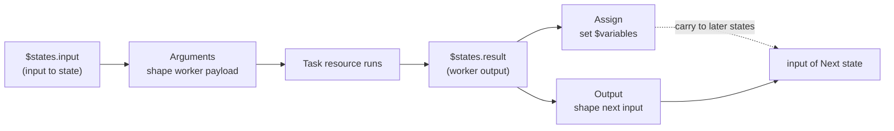

# ASL with JSONata

This scheduler defines state machines in the
[Amazon States Language (ASL) 1.0](https://states-language.net/spec.html), but
replaces JSONPath with **JSONata** for all data mapping, querying, and
transformation. This document is the guide to that dialect.

> Code: `AslJsonataEvaluator` (expression engine), the `*StateExecutor` beans,
> and `contextObject(...)` in `WorkflowInterpreter` (what `$states.context`
> contains).

---

## 1. One idea: every value can be an expression

Anywhere a state takes data, you can write a literal **or** a JSONata expression
wrapped in ``. The evaluator walks objects/arrays recursively, so an
expression can sit at any depth:

```json
"Arguments": {
  "id":   "",
  "tier": "GOLD",
  "tags": ""
}
```

A string is treated as an expression **only** if it's trimmed form starts with
``. Everything else is a literal. Inside an expression, the
**input** to the current state is the JSONata root (`$`), so `$states.input.x`
and `$.x` refer to the same thing.

Evaluation is bounded by a timeout (`mapping-timeout-ms`, default 1000 ms) and max
depth (`mapping-max-depth`, default 100) so a pathological expression can't freeze
a thread.

---

## 2. What's different from standard ASL

| Standard ASL | Here |
|---|---|
| JSONPath (`$.foo`) | **JSONata** in `` |
| `InputPath`, `Parameters` | `Arguments` |
| `ResultSelector`, `ResultPath` | `Assign` (variables) |
| `OutputPath` | `Output` |
| Intrinsics (`States.Format`, `States.Array`, …) | native JSONata (`&`, `[...]`, functions) |
| `$$` context object | the `$states.context` field |

`InputPath`, `Parameters`, `ResultSelector`, `ResultPath`, `OutputPath` are **not
supported** — use `Arguments` / `Assign` / `Output`.

---

## 3. Reserved variable: `$states`

Every expression gets a `$states` object with four fields:

| Field | Meaning | Available in |
|---|---|---|
| `$states.input` | input to the current state | **everywhere** |
| `$states.result` | result of a Task / Parallel / Map | `Assign`, `Output` of Task/Parallel/Map |
| `$states.errorOutput` | `{ Error, Cause }` of a caught failure | `Assign`, `Output` inside a `Catch` |
| `$states.context` | execution metadata (see below) | everywhere |

Variables you declare via `Assign` are exposed as top-level `$name` (not under
`$states`). E.g. `Assign: { "tier": ... }` → readable as `$tier` in later states.

### `$states.context` fields

These come from `contextObject(...)` in the interpreter — the real, available
keys:

| Key | Value |
|---|---|
| `WorkflowExecutionId` | the execution's UUID |
| `ExecutionScopeId` | this branch/iteration's scope UUID |
| `StateExecutionId` | this state-entry UUID |
| `StateName` | current state name |
| `StateSequence` | monotonic step number within the scope |
| `Map.Item.Index` | *(Map iterations only)* the item index |
| `Map.Item.Value` | *(Map iterations only)* the raw item |

---

## 4. Data flow: `Arguments` → worker → `Assign` / `Output`

The whole standard pipeline (`Parameters → ResultSelector → ResultPath →
OutputPath`) collapses into three fields:



| Field | Replaces | Allowed on | Can read | Purpose |
|---|---|---|---|---|
| `Arguments` | `Parameters` | Task, Parallel | `$states.input`, `$states.context` | build the payload sent to the worker/branch |
| `Assign` | `ResultPath` | all except Succeed/Fail | `+ $states.result` | declare `$variables` for later states |
| `Output` | `OutputPath`, `ResultSelector` | all except Fail | `+ $states.result` | the exact JSON passed to the `Next` state |

If `Output` is omitted, the state passes its `input` through — or its `result`
for Task/Parallel/Map. `Assign` and `Output` are independent: you can carry data
forward as a variable *and* shape the next input.

---

## 5. Worked example: a Task state

```json
"FetchCustomer": {
  "Type": "Task",
  "Resource": "voyager://mcp/crm/get-customer",
  "Arguments": {
    "id": ""
  },
  "Assign": {
    "customerEmail": "",
    "customerTier":  ""
  },
  "Output": {
    "userId": "",
    "readyForProcessing": true
  },
  "Next": "ProcessCustomer"
}
```

1. `Arguments` builds `{ "id": <userId> }` from the input and sends it to the
   resource.
2. The worker runs; its return value becomes `$states.result`.
3. `Assign` saves `$customerEmail` / `$customerTier` for later states.
4. `Output` shapes the JSON handed to `ProcessCustomer`.

---

## 6. Choice

Each rule has a `Condition` that must evaluate to a **boolean**. Rules are tried
in order; the first true one wins. A rule (and the `Default`) may also carry
`Assign` / `Output`.

```json
"CheckTier": {
  "Type": "Choice",
  "Choices": [
    {
      "Condition": "",
      "Next": "GoldProcessing"
    }
  ],
  "Default": "StandardProcessing"
}
```

If no rule matches **and** there is no `Default`, the state fails with
`States.NoChoiceMatched`. (`$customerTier` here came from an earlier `Assign`.)

---

## 7. Wait

`Seconds` or `Timestamp` may be literals or expressions. `Seconds` must evaluate
to a non-negative integer; `Timestamp` to an RFC 3339 string.

```json
"WaitUntilReady": {
  "Type": "Wait",
  "Seconds": "",
  "Next": "Proceed"
}
```

---

## 8. Error handling: `Retry` and `Catch`

`Retry` and `Catch` follow the ASL spec, but a `Catch` block can additionally use
`Assign` / `Output` (reading `$states.errorOutput`) to shape the fallback payload.

```json
"Catch": [
  {
    "ErrorEquals": ["States.TaskFailed"],
    "Next": "HandleFailure",
    "Assign": {
      "lastError": ""
    },
    "Output": {
      "recovered": false,
      "originalInput": ""
    }
  }
]
```

`$states.errorOutput` is `{ "Error": <name>, "Cause": <detail> }` and is only in
scope inside a `Catch` block's `Assign` / `Output`.

---

## 9. Quick reference: where JSONata fields apply

| State | `Arguments` | `Assign` | `Output` | Other expression fields |
|---|:---:|:---:|:---:|---|
| Task | ✅ | ✅ | ✅ | `TimeoutSeconds`, `HeartbeatSeconds` |
| Choice | — | ✅ (per rule / default) | ✅ (per rule / default) | `Condition` (→ boolean) |
| Wait | — | ✅ | ✅ | `Seconds` / `Timestamp` |
| Pass | — | ✅ | ✅ | — |
| Parallel | ✅ | ✅ | ✅ | — |
| Map | — | ✅ | ✅ | `Items`, `ItemSelector`, `MaxConcurrency` |
| Succeed | — | — | ✅ | — |
| Fail | — | — | — | `Error`, `Cause` |

`$states.result` is gated by the validator, not just convention. It is allowed
**only** in `Assign` / `Output` of **Task, Parallel, Map** (for Parallel/Map it's
the ordered array of branch/iteration outputs). It is **rejected** in `Arguments`
and `ItemSelector`. Likewise
`$states.errorOutput` is allowed only inside a `Catch` block's `Assign`/`Output`.

---

## 10. What the validator enforces (at activation)

`AslStateDefinitionValidator` checks a definition when it's registered, so the
runtime never sees a malformed machine. Beyond per-state field whitelists, it
enforces:

**Dialect (no JSONPath leaking in):**

- JSONPath-only fields are rejected: `InputPath`, `OutputPath`, `Parameters`,
  `Result`, `ResultPath`, `ResultSelector`, `ItemsPath`, and every `*Path`
  variant (`SecondsPath`, `MaxConcurrencyPath`, `ErrorPath`, …).
- Any object key ending in `.$` is rejected (the JSONPath "value-from-path" form).
- Per-state `QueryLanguage` overrides are rejected.
- JSONPath `Choice` operators (`Variable`, `And`/`Or`/`Not`, `StringEquals`,
  `NumericLessThan`, `IsPresent`, …) are rejected — use a `Condition` expression.

**Structure:**

- A transitioning state must have **exactly one** of `Next` / `End`; `End` must be
  literally `true`; `Next` must name a state in the same `States` object.
- `Wait` must have **exactly one** of `Seconds` / `Timestamp`. `Seconds` is a
  non-negative integer (or expression); `Timestamp` is RFC 3339 with uppercase
  `T`/`Z`.
- `Choice` needs a non-empty `Choices`; each rule's `Condition` must be an
  expression; missing match + no `Default` → `States.NoChoiceMatched` at runtime.
- `Parallel` needs a non-empty `Branches`; `Map` needs an `ItemProcessor`
  (deprecated `Iterator` is rejected).

**Variables:**

- The name `states` is reserved. Variable names must be Unicode identifiers of
  ≤ 80 code points.

**Errors, Retry, Catch:**

- `ErrorEquals` must be a non-empty array. Unknown names using the reserved
  `States.` prefix are rejected — only these are allowed: `States.ALL`,
  `States.Timeout`, `States.TaskFailed`, `States.Permissions`,
  `States.BranchFailed`, `States.NoChoiceMatched`, `States.QueryEvaluationError`.
- `States.ALL` must appear **alone** in an `ErrorEquals` and the retrier/catcher
  containing it must be **last**.
- `Retry`: `IntervalSeconds`/`MaxDelaySeconds` positive ints, `MaxAttempts`
  non-negative, `BackoffRate ≥ 1.0`. `JitterStrategy` only `FULL` is supported.

**Resource & Map limits:**

- A `Task` `Resource` must be a valid URI with a scheme. The runtime routes
  `voyager://system/webhook`, `voyager://system/send-email`,
  `voyager://mcp/<serverId>/<toolName>[?trust=…]`, and
  `voyager://function/<name>[@vN]`; the two registry-backed forms also get
  save-time existence checks (server + tool registered and synced; function
  enabled with the referenced version published).
- `Map` `ProcessorConfig.Mode`: only `INLINE` is implemented.
- `Map` `ItemReader`, `ItemBatcher`, `ResultWriter`, `ToleratedFailureCount`, and
  `ToleratedFailurePercentage` are not supported and are rejected as
  `RUNTIME_SUPPORT` issues. A supported Map uses `Items` (or the array state
  input), `ItemSelector`, `MaxConcurrency`, and an inline `ItemProcessor`.

Issues are categorized as `DIALECT` (JSONPath leakage), `ASL` (spec/structure),
or `RUNTIME_SUPPORT` (valid ASL the runtime doesn't implement yet).
