# Functions

Voyager Functions are small, versioned programs that run inside the platform's sandboxed code runner (Judge0) and plug into workflows as Task states. A function receives JSON on standard input, does its work, and writes JSON to standard output — that output becomes the state result the rest of the workflow consumes. Functions are the escape hatch for logic that JSONata expressions can't express: custom math, parsing, enrichment, format conversion, anything you'd rather write in a real language.

This guide covers the complete feature: creating a function in the workbench, every attribute and what it controls, versioning, test cases, invocation history, and how to call a function from a workflow.

- [How a function runs: the stdin/stdout contract](#how-a-function-runs-the-stdinstdout-contract)
- [Concepts: functions, versions, invocations](#concepts-functions-versions-invocations)
- [Creating a function](#creating-a-function)
- [The function detail page](#the-function-detail-page)
- [Versions tab: drafts, publishing, activation](#versions-tab-drafts-publishing-activation)
- [Tests tab: running saved cases against a published version](#tests-tab-running-saved-cases-against-a-published-version)
- [Invocations tab: execution history](#invocations-tab-execution-history)
- [Settings tab: availability and execution limits](#settings-tab-availability-and-execution-limits)
- [Using functions in workflows](#using-functions-in-workflows)
- [Attribute reference](#attribute-reference)
- [Error names reference](#error-names-reference)
- [HTTP API reference](#http-api-reference)
- [Operator configuration](#operator-configuration)

## How a function runs: the stdin/stdout contract

Every execution follows the same contract, regardless of language:

```text
workflow state input (or Arguments)  ──►  stdin   (one JSON document)
your program                              runs under CPU/wall/memory limits
stdout (one JSON document)           ──►  $states.result for the next state
```

The rules:

1. **Input is one JSON document on stdin.** When a workflow invokes the function, the Task state's evaluated `Arguments` (or the raw state input if `Arguments` is omitted) is piped to stdin. In the workbench and Tests tab, the test case's input JSON plays that role.
2. **Output must be one valid JSON document on stdout.** The runner parses stdout; anything that isn't valid JSON fails the run with `Function.InvalidOutput`. Blank stdout fails the same way. Don't print log lines to stdout — use stderr for diagnostics; it is captured and shown in results but never parsed.
3. **A non-zero exit or runtime crash fails the run** with `Function.RuntimeError` (or a more specific error — see the [error reference](#error-names-reference)).
4. **Output is truncated at the version's `maxOutputBytes`** before parsing, so oversized output typically surfaces as `Function.InvalidOutput`.

When you pick a language in the workbench, the editor seeds a starter template that already implements this contract, e.g. for Python:

```python
import json
import sys

# Voyager passes the workflow state input to your function through stdin.
# Write JSON to stdout so the next workflow state can consume it.
def main():
    raw_input = sys.stdin.read()
    payload = json.loads(raw_input) if raw_input.strip() else {}
    result = {
        "received": payload,
        "ok": True,
    }
    json.dump(result, sys.stdout)

if __name__ == "__main__":
    main()
```

## Concepts: functions, versions, invocations

Three records make up the feature:

| Record | What it is |
|---|---|
| **Function** (definition) | The named container: `name`, `description`, `status` (`ENABLED` / `DISABLED` / `ARCHIVED`), and a pointer to the **active version**. The name is immutable after creation. |
| **Function version** | A numbered snapshot of everything needed to run: language, source mode, code (or file bundle), compiler options, command-line arguments, resource limits, network flag, changelog note, and saved test cases. Versions move `DRAFT → AVAILABLE → ARCHIVED`. |
| **Invocation** | One persisted execution record — status, input, parsed output, stdout/stderr, compile output, timing, memory, error name, and (when a workflow triggered it) the workflow execution ID and state name. |

Version lifecycle:

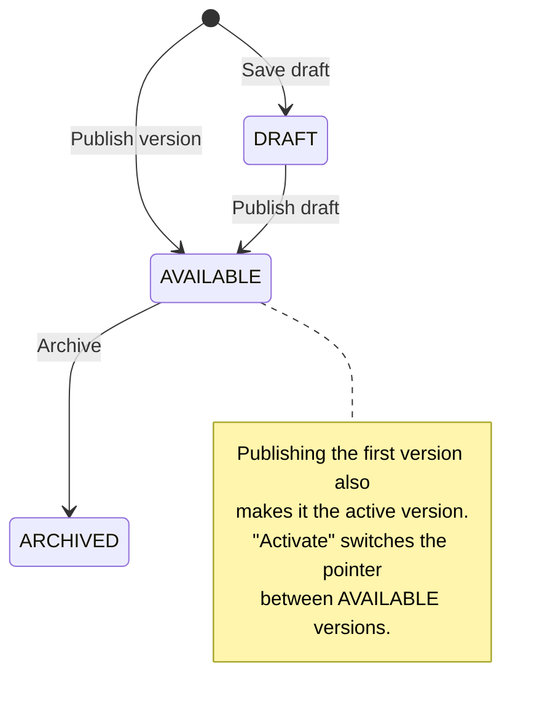

Only `AVAILABLE` (published) versions can run. The **active version** is what unpinned references resolve to; you can point it at any published version with **Activate**, which is also the rollback mechanism — activating an older version takes effect on the next run.

How workflow references resolve:

| Resource URI | Resolves to |
|---|---|
| `voyager://function/tax-calculator@v3` | Version 3, pinned (also accepts `@3`) |
| `voyager://function/tax-calculator@latest` | The active version at each run |
| `voyager://function/tax-calculator` | Same as `@latest` |

## Creating a function

Open **Functions** in the sidebar. The list page shows metric tiles (live / active / paused / draft counts), search, an archived toggle, and a card per function.

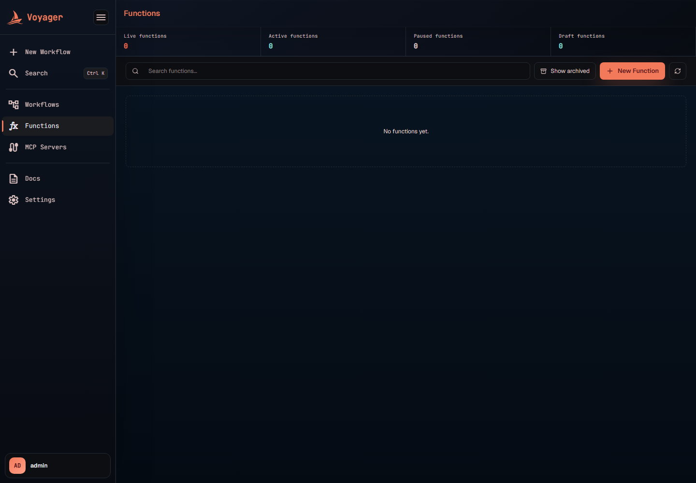

### Step 1 — New Function

Click **New Function**. This opens the full-screen workbench with the metadata strip on top and the IDE below.


Fill in:

- **Name** — lowercase letters, digits, and hyphens (`^[a-z0-9][a-z0-9-]*$`), e.g. `tax-calculator`. This becomes the URI (`voyager://function/tax-calculator`) and **cannot be changed later**, so choose deliberately.
- **Language** — the dropdown lists the Judge0 runtimes the platform allows (SQL and pseudo-runtimes are excluded; operators can further restrict the list — see [Operator configuration](#operator-configuration)). Picking a language loads its starter template.
- **Description** — a human-readable summary shown on the card, the detail page, and the settings tab.
- **Source mode** — `Single file` (one editor buffer) or `Multi-file` (a file tree bundled as a zip). Switching to multi-file narrows the language list to runtimes that support multi-file programs and unlocks the **Files** panel for creating folders and supporting files. The workbench derives and validates the required entry file per language (e.g. `main.py` for Python — shown in the status bar).

The banner under the metadata is the contract reminder: *"Workflows send input to your function through stdin. Write JSON to stdout so the next state receives it."*

### Step 2 — Write the code

The IDE is a docked layout: **Files**, **Editor** (Monaco, with syntax highlighting per language), and the testing column with **Test cases**, **Run input**, and **Output** panels.

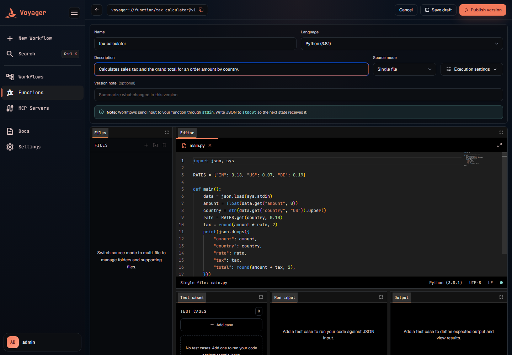

### Step 3 — Add test cases and run them

Test cases let you execute the code you're editing against sample input **before anything is saved** — runs from the workbench are ad-hoc (they call the runner directly and are not recorded in the invocation history).

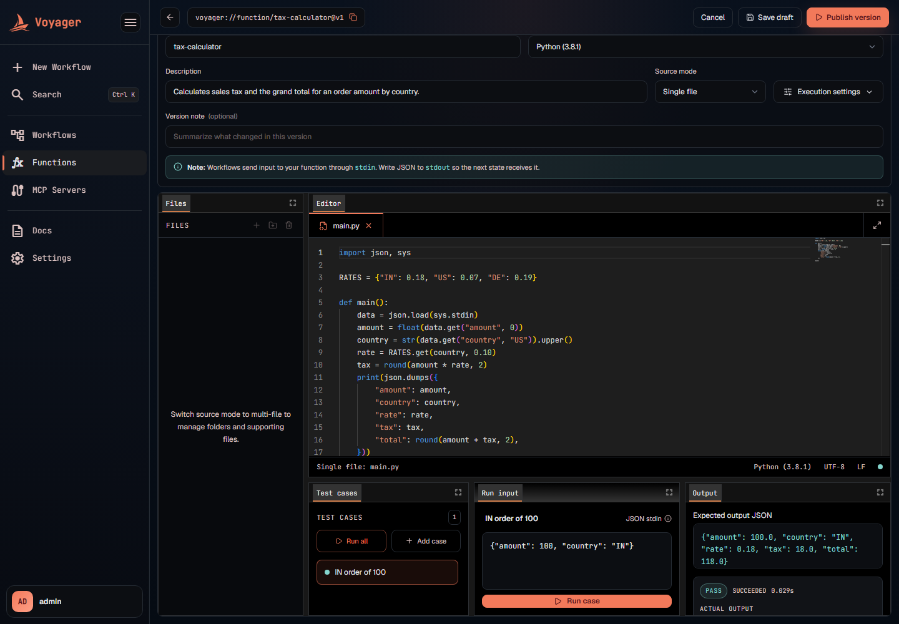

Each test case has:

| Field | Meaning |
|---|---|
| **Name** | Label shown in the case list (defaults to `Case 1`, `Case 2`, …). |
| **Input (JSON stdin)** | Must be valid JSON; it is piped to your program's stdin. |
| **Expected output JSON** | Optional. Blank means "just check it runs successfully". When set, the result is compared as *canonical JSON* (key order and whitespace don't matter). If the expected text isn't valid JSON, it falls back to an exact-match comparison against trimmed stdout. |
| **Expected error** | Optional text for asserting failure output. |

**Run case** executes the selected case; **Run all** executes every case. The Output panel shows the Pass/Fail chip, the runner status (`SUCCEEDED`, execution time), the parsed actual output, and stderr/compile output when present. A version can carry up to 100 saved cases; they are stored with the version when you save or publish, so they double as living documentation of the function's expected behavior.

### Step 4 — Execution settings and the version note

**Execution settings** (top-right of the workbench) opens the resource-limit dialog. Leave **Use workspace defaults** on, or switch it off to set per-version limits — the full list of attributes and their defaults is in the [attribute reference](#attribute-reference).


The **Version note** ("Summarize what changed in this version", up to 2,000 characters) is the changelog line displayed in the version history — write one; future you will thank you.

### Step 5 — Save draft or Publish

- **Save draft** creates the version in `DRAFT` status. Drafts are fully editable in place but cannot run from workflows.
- **Publish version** creates it as `AVAILABLE`. Publishing the **first** version of a function also makes it the active version automatically, so the function is immediately runnable at `voyager://function/<name>`.

If a function has **no description**, one is generated by the default Chat model after publication/activation, so the AI resource catalog and its embeddings have meaningful text to match against. A description you write always wins and is never overwritten. See [AI Workflow Generator — What the assistant can use](ai-workflows.md#what-the-assistant-can-use).

Back on the list page, the function appears as a card with its status dot, active version badge, and last-updated time:

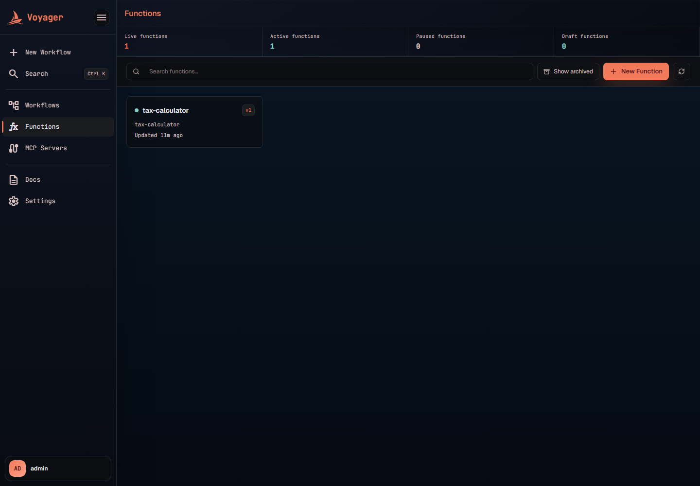

## The function detail page

After publishing you land on the detail page: summary tiles (active version, source mode, last updated, total versions), the hero card with description and runtime chips (language, source mode, network access, status), and the **Function URI** copy button — the exact string to paste into a workflow Task's `Resource`.

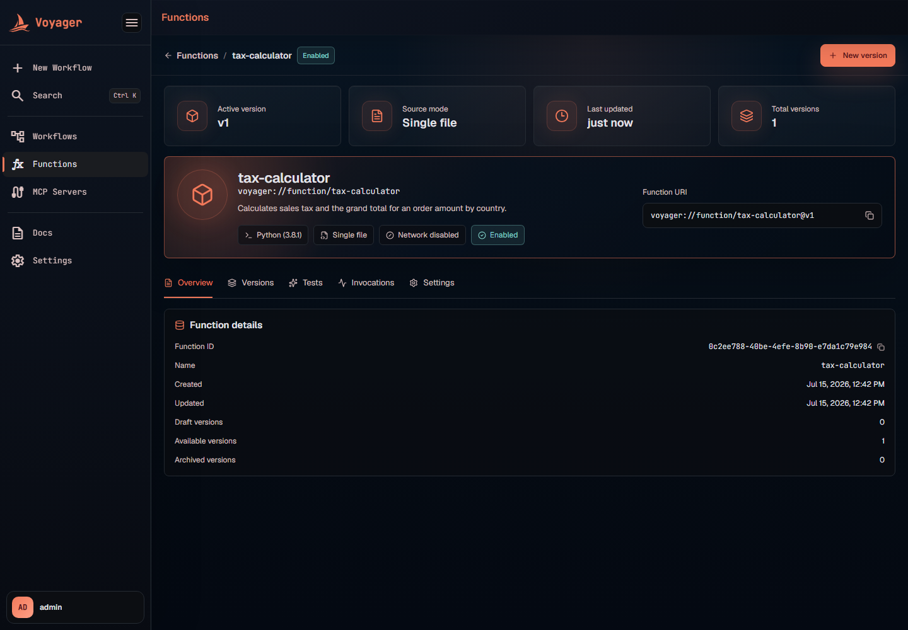

The **Overview** tab lists identity and audit fields: function ID, name, created/updated timestamps, and per-status version counts.

## Versions tab: drafts, publishing, activation

The Versions tab is a two-pane view: the version list (active first, then newest first, with status chips and note excerpts) and the inspector showing the selected version's read-only source, its saved test cases, and the full configuration grid (IDs, language, source mode, limits, network, note, timestamps).

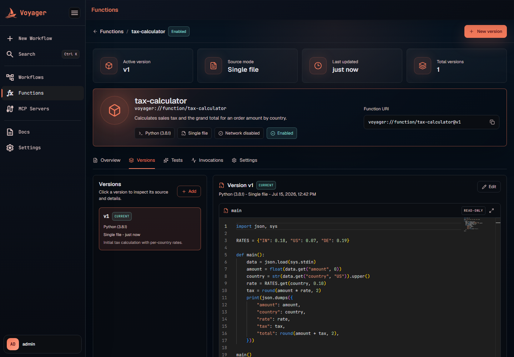

Editing rules — this is the part worth internalizing:

- **Drafts are mutable.** *Edit draft* opens the workbench on the draft and overwrites it in place until you publish it (*Publish & activate*).
- **Published versions are immutable where it matters.** Editing a published version saves *metadata* — the note, execution settings, and test cases — onto that version in place. But changing the **code or language forks a new version** instead; the workbench banner tells you exactly which version number the fork will get.
- **Publish draft** promotes a draft to `AVAILABLE`. **Activate** appears on any published, non-active version and switches the active pointer to it (this is rollback/roll-forward).

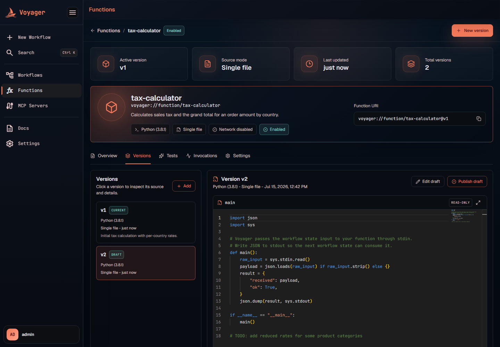

**New version** (header button) pre-selects the active version's language, source mode, and test cases so iterating is cheap.

## Tests tab: running saved cases against a published version

Where the workbench runs whatever is in the editor buffer, the Tests tab runs the *persisted* code of a chosen version — pick the version in the selector (defaults to the current/active one), check the cases you care about, and use **Run selected** or **Run all**.

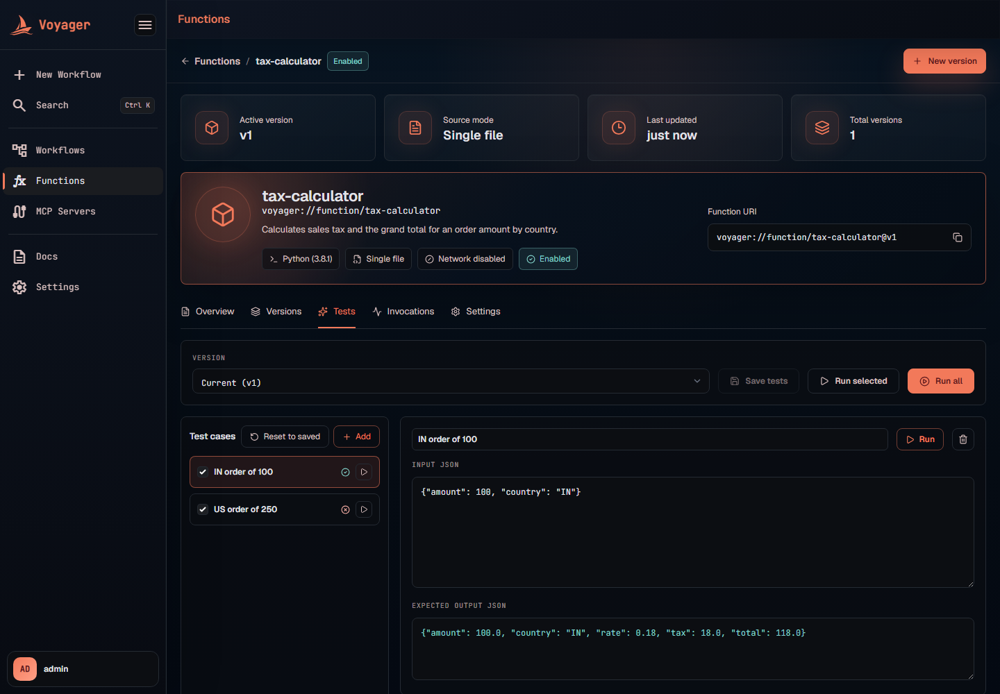

Like workbench runs, these are ad-hoc executions: they exercise the saved code through the same runner but are **not** recorded in the invocation history. Edits you make to cases here can be written back to the version with **Save tests** (or discarded with **Reset to saved**).

## Invocations tab: execution history

Every persisted run appears here, newest first. Two things create invocation records: **workflow Task states** that call the function, and the **`test-invocations` API** (`POST /app/v1/functions/{id}/test-invocations`), which runs a published version with a given input and records the result. Workbench and Tests-tab runs are ad-hoc and intentionally leave no trace here.

Expanding a row shows the input, the parsed output, stdout/stderr, compile output, exit code, the runner's status ID and description, execution time, wall time, memory, and the error name/message on failure. Workflow-triggered rows also carry the workflow execution ID and the state name that invoked the function, so you can trace a run back to its workflow.

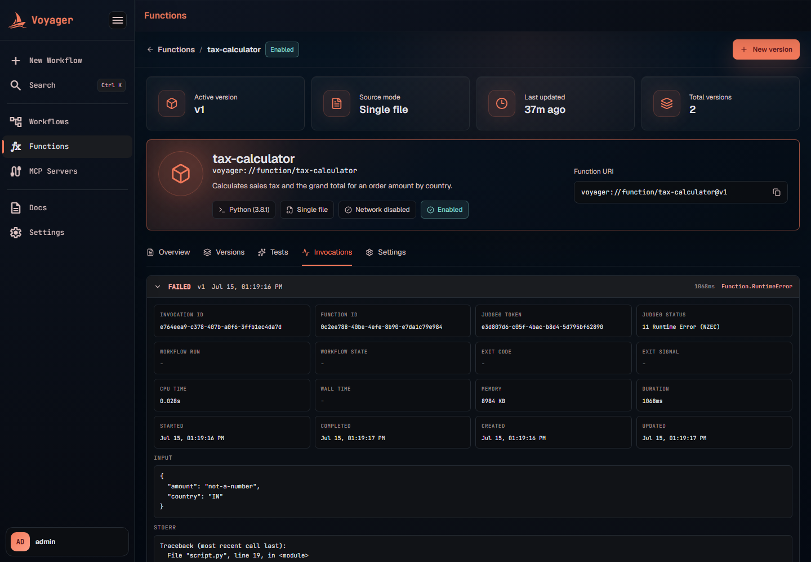

Note on retention: when the opt-in workflow execution cleanup deletes old execution trees, invocations linked to those executions are deleted with them.

## Settings tab: availability and execution limits

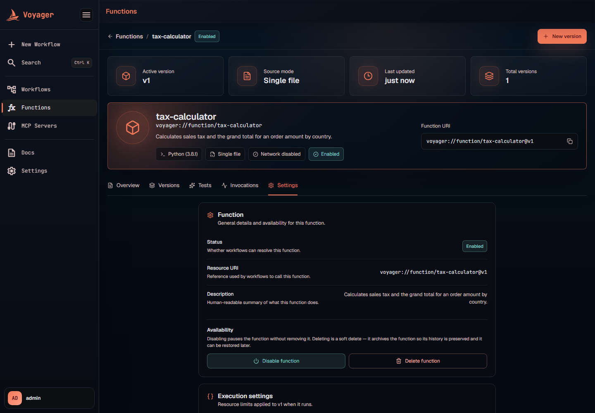

**Function section** — status, resource URI, description, and the availability controls:

- **Disable function** pauses it without removing anything. Workflows can no longer resolve it: a Task that references it fails with `States.Permissions` at run time, and saving a workflow that references it is rejected by save-time validation. Enable again to restore.
- **Delete function** is a **soft delete**: the function is archived, not removed. It stops resolving for workflows, its versions and history are preserved, it stays visible under *Show archived*, and its name remains reserved. (Restoring currently goes through the update API — set the status back to `ENABLED` via `PUT /app/v1/functions/{id}`.)

**Execution settings section** — edits the resource limits of the *current* version (CPU/wall time, memory, max file size, max output, network access, compiler options, command-line arguments) with inline validation. Saving asks for confirmation and applies on the function's next run:


## Using functions in workflows

Reference a function from any Task state with a `voyager://function/...` resource. Pin the version for reproducibility, or track the active version for continuous delivery:

```json
{
  "CalculateTax": {
    "Type": "Task",
    "Resource": "voyager://function/tax-calculator@v1",
    "Arguments": {
      "amount": "",
      "country": ""
    },
    "Retry": [
      {
        "ErrorEquals": ["Function.PlatformError", "States.Timeout"],
        "MaxAttempts": 3,
        "IntervalSeconds": 5,
        "BackoffRate": 2.0
      }
    ],
    "Catch": [
      {
        "ErrorEquals": ["Function.RuntimeError", "Function.InvalidOutput"],
        "Next": "HandleBadCalculation"
      }
    ],
    "Output": "",
    "Next": "SendInvoice"
  }
}
```

- The evaluated `Arguments` object is what arrives on stdin. Omit `Arguments` to pass the raw state input.
- The function's stdout JSON becomes `$states.result`.
- On failure, `$states.errorOutput` carries the stable error name and cause.

**Save-time validation.** Workflow definitions are validated when saved or activated: the referenced function must exist and be enabled, and the pinned version (or the active version, for unpinned references) must exist and be published. Mistakes fail immediately in the editor with issue codes `FUNCTION_RESOURCE_INVALID`, `FUNCTION_NOT_FOUND`, `FUNCTION_DISABLED`, `FUNCTION_NO_ACTIVE_VERSION`, `FUNCTION_VERSION_NOT_FOUND`, or `FUNCTION_VERSION_NOT_AVAILABLE` — instead of days later as a runtime failure. The runtime checks still exist to cover drift after activation (e.g. a function archived while a workflow references it).

## Attribute reference

### Function (definition)

| Attribute | Rules | Notes |
|---|---|---|
| `name` | required, `^[a-z0-9][a-z0-9-]*$` | Immutable; becomes the URI segment. Unique across the registry, including archived functions. |
| `description` | optional text | Shown on cards, the hero, and settings. |
| `status` | `ENABLED` / `DISABLED` / `ARCHIVED` | Only `ENABLED` functions resolve for workflows. `DISABLED` and `ARCHIVED` fail as `States.Permissions` at run time. |
| `activeVersion` | set automatically on first publish | Target of unpinned references; switch with **Activate**. |

### Function version

| Attribute | Default | Constraints | What it controls |
|---|---|---|---|
| `sourceMode` | `SINGLE_FILE` | `SINGLE_FILE` / `MULTI_FILE` | One editor buffer vs. a file tree. Multi-file requires a runtime that supports it. |
| `languageId` | — | required | Judge0 runtime, filtered by the platform policy. |
| `sourceCode` | starter template | ≤ 256 KiB | The program (single-file mode). |
| `additionalFilesBase64` | — | ≤ ~4 MiB encoded | Zip bundle of the file tree (multi-file mode). |
| `compilerOptions` | empty | ≤ 512 chars | Passed to the compiler for compiled languages (e.g. `-O2 -pipe`). |
| `commandLineArguments` | empty | ≤ 512 chars | argv passed to your program. |
| `cpuTimeLimitSeconds` | `2.0` | ≥ 0.1 | CPU time budget; exceeding it ends the run as `States.Timeout`. |
| `wallTimeLimitSeconds` | `10.0` | ≥ 0.1, ≥ CPU time | Wall-clock budget. |
| `memoryLimitKb` | `131072` (128 MB) | ≥ 1024 | Memory ceiling; exhaustion surfaces as `Function.MemoryExceeded`. |
| `maxFileSizeKb` | `1024` | ≥ 1 | Largest file the program may create. |
| `maxOutputBytes` | `65536` | ≥ 1 | stdout is truncated to this before parsing. |
| `enableNetwork` | `false` | operator-gated | Outbound network access during execution. |
| `note` | empty | ≤ 2,000 chars | Changelog line in the version history. |
| `testCases` | `[]` | ≤ 100 cases; fields ≤ 64 KiB | Saved with the version; runnable from workbench and Tests tab. |
| `status` | `AVAILABLE` on publish | `DRAFT` / `AVAILABLE` / `ARCHIVED` | Only `AVAILABLE` versions run. |

The defaults come from `scheduler.judge0.default-*` application properties, so operators can change platform-wide defaults without touching saved versions.

## Error names reference

Function failures map to a stable error vocabulary that workflows match in `Retry`/`Catch` — internal exception classes never leak:

| Error name | Raised when | Retry advice |
|---|---|---|
| `Function.NotFound` | Function name unknown, pinned version missing, no active version for an unpinned reference, or version not published | Don't retry — fix the reference (save-time validation catches most of these). |
| `Function.CompileError` | Compilation failed (compiled languages) | Don't retry — fix the code. |
| `Function.RuntimeError` | Program crashed or exited non-zero | Retry only if the code is idempotent and the failure is environmental. |
| `Function.MemoryExceeded` | Memory limit reached (detected via runner status or reported usage ≥ limit) | Don't retry — raise the limit or reduce usage. |
| `Function.InvalidOutput` | stdout blank, not valid JSON, or truncated past `maxOutputBytes` | Don't retry — fix the output. |
| `Function.PlatformError` | The runner itself was unreachable or errored | Retryable — usually transient. |
| `States.Timeout` | CPU or wall time limit exceeded | Retryable if the input can genuinely finish in time. |
| `States.Permissions` | Function is disabled/archived, or the runner rejected the platform's credentials (401/403) | Don't retry — re-enable the function or fix credentials. |

## HTTP API reference

Base path: `/app/v1/functions`

| Method & path | Purpose |
|---|---|
| `GET /languages` | Supported runtimes (id, name, multi-file support). |
| `GET /runtime` | Runner info (limits, network gate). |
| `POST /run` | Ad-hoc execution of unsaved code (workbench runs; not persisted). |
| `POST /` | Create a function definition. |
| `GET /?includeArchived=` | List functions. |
| `GET /{functionId}` | Get one function. |
| `PUT /{functionId}` | Update description/status (name immutable). |
| `DELETE /{functionId}` | Soft delete — archives the function. |
| `POST /{functionId}/versions` | Create a version (`status`: `DRAFT` or `AVAILABLE`). |
| `GET /{functionId}/versions` | List versions. |
| `PUT /{functionId}/versions/{v}` | Update a draft in place. |
| `PUT /{functionId}/versions/{v}/metadata` | Update note/settings/test cases of a published version in place. |
| `POST /{functionId}/versions/{v}/publish` | Promote a draft to `AVAILABLE` (first publish also activates). |
| `POST /{functionId}/versions/{v}/activate` | Point the active version at a published version. |
| `PUT /{functionId}/versions/{v}/settings` | Update execution limits only. |
| `POST /{functionId}/test-invocations` | Run a persisted version with given input (recorded). |
| `GET /{functionId}/invocations` | Invocation history. |

## Operator configuration

| Setting | Env var (docker-compose) | Meaning |
|---|---|---|
| `scheduler.judge0.base-url` | `JUDGE0_BASE_URL` | Runner endpoint (compose default `http://judge0-server:2358`, private to the Docker network). |
| `scheduler.judge0.auth-token` | `JUDGE0_AUTH_TOKEN` | Optional `X-Auth-Token` for secured runners. |
| `scheduler.judge0.allowed-language-ids` | `JUDGE0_ALLOWED_LANGUAGE_IDS` | Comma-separated Judge0 ids. Blank = all real program runtimes except SQL and pseudo-runtimes (`executable`, `multi-file program`, `plain text`). |
| `scheduler.judge0.ai-default-language-id` | `JUDGE0_AI_DEFAULT_LANGUAGE_ID` | Runtime used for every AI-generated function. Defaults to Judge0 Python id `71`; falls back to an available Python runtime, then the first allowed runtime. |
| `scheduler.judge0.default-*` | — | Platform defaults for the per-version limits listed above. |
| `ALLOW_ENABLE_NETWORK` (judge0.conf) | — | Master gate for the per-version `enableNetwork` flag. |

The local stack runs Judge0 as four compose services (`judge0-server`, `judge0-worker`, `judge0-db`, `judge0-redis`). The app exposes a `judge0` health indicator at `/actuator/health` that reports UP only when the runner advertises languages **and** at least one execution worker is registered; it degrades overall health without failing liveness/readiness probes, so a runner outage is visible but doesn't restart the app.
