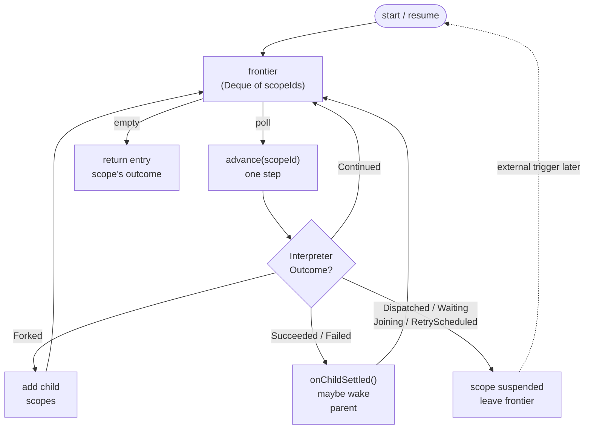
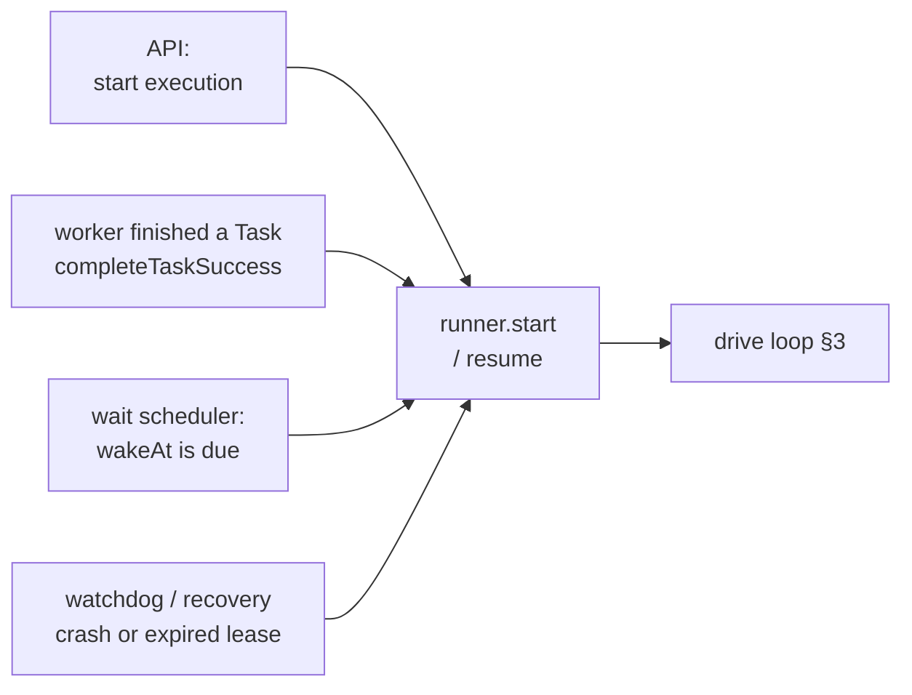
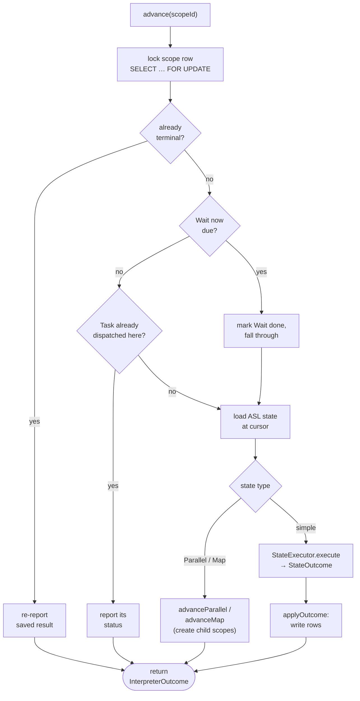
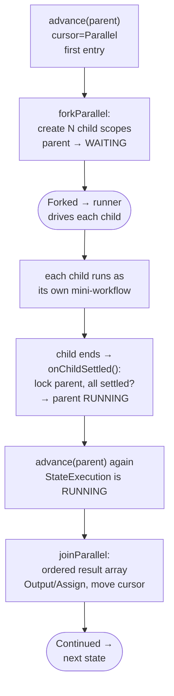
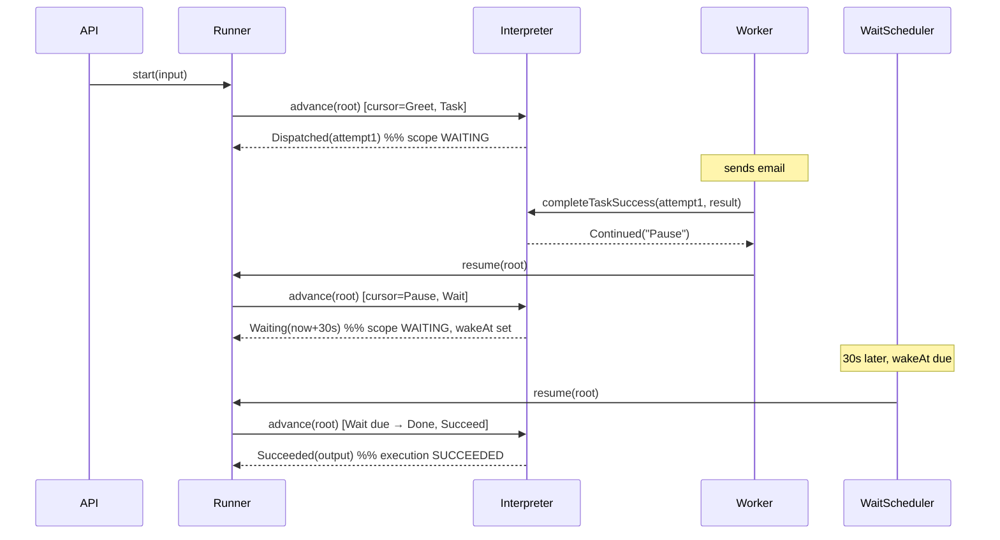
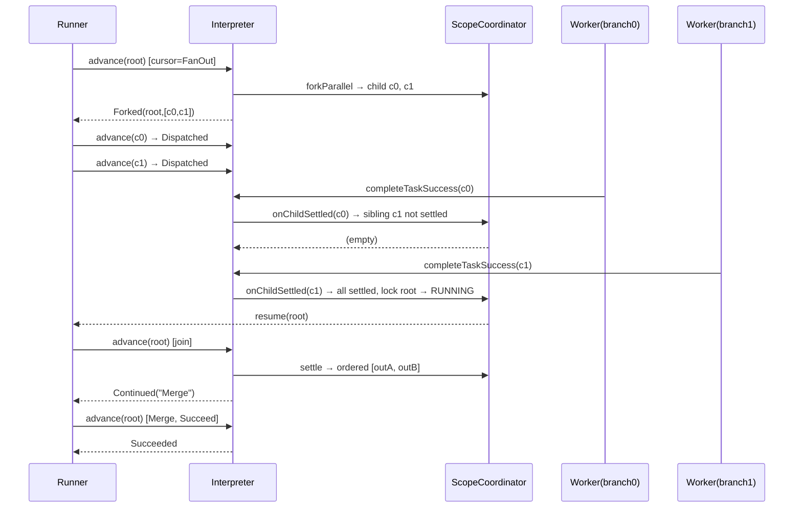

# Workflow Interpreter Internals

How the ASL workflow interpreter runs a workflow: the mental model, the moving
parts, and two worked traces.

> Code: `WorkflowInterpreter`, `WorkflowExecutionRunner`,
> `ExecutionScopeCoordinator`, the `StateExecutor` beans, and the
> `InterpreterOutcome` / `StateOutcome` sealed interfaces (under
> `com.job.scheduler.workflow.asl.runtime`, runner under `..service`).

---

## 1. Two ideas that explain everything

**The database is the program counter.** The interpreter keeps no in-memory
state. Where a workflow is, and all its data, live in PostgreSQL rows. So it can
crash, restart, move nodes, or be called twice and just continue: read the row,
do one step, write the row back.

**`advance()` is one step, not a loop.** `WorkflowInterpreter.advance(scopeId)`
does one unit of work for one scope and returns a value describing what happened.
The looping is the *runner's* job (§3).

```
advance(current state of one scope) -> (new saved state, InterpreterOutcome)
```

Hold those two and the rest is detail.

---

## 2. The durable entities

| Entity | One row per… | Holds |
|---|---|---|
| `WorkflowExecution` | a run | overall status, final output |
| `ExecutionScope` | a *branch* of execution | the cursor (`currentStateName`, `currentStateInput`), `variables`, `status`, `wakeAt` |
| `StateExecution` | one entry into a state | what that state did (`status`, `output`) |
| `StateExecutionAttempt` | one *try* of a Task | dispatched work (`arguments`, `result`, `status`) |

The key one is **`ExecutionScope`** — the "thread of execution." A linear
workflow has one (the **ROOT**). A `Parallel`/`Map` state spawns **child** scopes
(one per branch / iteration), each driven by the same `advance()` machinery. Only
a ROOT scope mirrors its status onto the `WorkflowExecution` — a child finishing
must not end the whole run while siblings are live.

Scope status: `PENDING → RUNNING →` one of `SUCCEEDED / FAILED / CANCELED /
TIMED_OUT` (terminal), or `WAITING` / `RETRY_WAIT` (suspended — something will
call `advance()` again later).

---

## 3. The driver loop — `WorkflowExecutionRunner`

`advance()` does one step; the runner calls it in a loop over a work-list
("frontier") of ready scope ids:

```java
Deque<UUID> runnable = new ArrayDeque<>();
runnable.add(entryScopeId);
while (!runnable.isEmpty()) {
    UUID scopeId = runnable.poll();
    InterpreterOutcome outcome = workflowInterpreter.advance(scopeId);  // ONE step
    scheduleFollowups(scopeId, outcome, runnable);                      // what's next?
}
```

`scheduleFollowups` is the whole control flow:

- `Continued` → re-add the same scope (keep stepping)
- `Forked` → add the new child scopes
- `Succeeded`/`Failed` → `onChildSettled(scope)` may wake a waiting parent
- `Waiting` (future) / `Dispatched` / `RetryScheduled` / `Joining` → do nothing;
  the scope is suspended until an external trigger (§4) resumes it

So a linear workflow can run to completion in one `drive()` call — each
`Continued` loops back. The loop only exits when the scope **suspends** or
**finishes**. (`maximumInlineTransitions`, default 10000, guards against a
self-looping workflow.)



---

## 4. Who wakes a suspended scope (the four triggers)

Each calls `runner.resume(executionId, scopeId)`, which is just `drive()` from
that scope.



1. **API start** — `WorkflowController` → `runner.start(...)`.
2. **Task completion** — `WorkflowTaskWorkerService` runs the resource, calls
   `completeTaskSuccess/Failure/Timeout`, then `resume(...)`.
3. **Timer due** — `DueWorkflowWaitSchedulerService` polls ~1s for scopes whose
   `wakeAt` passed and resumes them (Wait, retry backoff, Map poll backstop).
4. **Recovery** — watchdogs re-drive scopes/attempts dropped by a crash or
   expired heartbeat. Safe because `advance()` is idempotent (§7).

---

## 5. One step — `advance()` and the two "outcome" types



The terminal / wait-due / already-dispatched guards at the top are what make
`advance()` **idempotent**: any trigger can call it (even twice, even
concurrently) and a redundant call just re-reports state instead of redoing work.

### Two vocabularies of "outcome" (the #1 confusion)

- **`StateOutcome`** — returned by a `StateExecutor`. *Intent* of one state, no
  DB effect: `Continue`, `Succeed`, `Fail`, `Waiting`, `DispatchTask`.
- **`InterpreterOutcome`** — returned by `advance()` to the runner. *Committed*
  durable result: `Continued`, `Succeeded`, `Failed`, `Waiting`, `Dispatched`,
  `RetryScheduled`, `Forked`, `Joining`.

`applyOutcome()` is the bridge: it takes the state's `StateOutcome`, **writes the
rows**, and returns the matching `InterpreterOutcome`. E.g. `DispatchTask` →
"save a PENDING attempt, set scope WAITING" → returns `Dispatched`.

### Simple vs compound states

- **Simple** (`Pass`, `Task`, `Choice`, `Wait`, `Succeed`, `Fail`) are pluggable
  `StateExecutor` beans in an `EnumMap`. Each is a small, unit-tested
  `(stateDefinition, context) -> StateOutcome` function that touches **no** DB
  and knows nothing about scopes.
- **Compound** (`Parallel`, `Map`) are handled inline in the interpreter
  (`advanceParallel`/`advanceMap`) because they create and coordinate child
  scopes — they can't be a stateless function. This is the one deliberate
  asymmetry.

---

## 6. Compound states: fork and join

A `Parallel`/`Map` state forks **child scopes** and waits for them.
`ExecutionScopeCoordinator` is the only place that reasons across parent +
children.

- A child gets a **snapshot copy** of the parent's variables (isolation), its own
  input, and its own cursor.
- A **generation** = the fork's `StateExecution.sequenceNumber`, embedded in each
  child's `scopePath` (`…/State/g1/branch-0`). A compound retry re-forks a *new*
  generation, so retried children never collide; "this fork's children" is a
  path-prefix query.
- `coordinator.settle(children)` reports: all terminal? any failed? + outputs **in
  index order** (so a Parallel result preserves branch order).



`onChildSettled` locks the parent and only proceeds if it's still `WAITING`, so
two children settling at once can't both advance the parent. A failed
`PARALLEL_BRANCH` cancels its live siblings and fails the join (Retry → Catch →
fail), mirroring single-Task failure at the compound level. `Map` adds the same
shape plus `ItemReader`, `MaxConcurrency` windowing (wave-by-wave forking),
`ItemBatcher`, failure tolerance, and `ResultWriter`.

---

## 7. Why it's safe without an event log

1. **Row locks** — `advance()` opens with `findByIdForUpdate` (`SELECT … FOR
   UPDATE`); concurrent advances of the *same* scope serialize, different scopes
   don't block. `onChildSettled` locks the parent likewise.
2. **Terminal guards** — every entry point re-reports a recorded result if the
   scope/attempt is already terminal, so a **duplicate worker result** won't
   re-apply `Assign`/`Output`, double-retry, or move the cursor twice.
3. **Status-as-cursor** — the next action is derived purely from durable status,
   so replaying after a crash recomputes the same step.
4. **Idempotent forks** — `forkBranch`/`forkIteration` key off the durable
   `scopePath`; replay returns the existing child.

Net effect: at-least-once triggering becomes effectively-once transitions —
exactly the property an event-sourcing rewrite would have to provide. You already
have it.

---

## 8. Expressions (JSONata)

`AslJsonataEvaluator` treats any `` string as an expression and recursively
evaluates objects/arrays. Bound vars: `$states.input`, `$states.result` (Task
result, in `Assign`/`Output`), `$states.errorOutput` (`{Error, Cause}`, in
`Catch`), `$states.context` (ids/state name; inside a Map iteration,
`…Map.Item.{Index,Value}`), and `$myVar` (set via `Assign`). Evaluation is bounded
by a timeout and max depth.

---

## 9. Worked example A — linear workflow

```json
{ "StartAt": "Greet", "States": {
  "Greet": { "Type": "Task", "Resource": "email",
             "Arguments": "", "Next": "Pause" },
  "Pause": { "Type": "Wait", "Seconds": 30, "Next": "Done" },
  "Done":  { "Type": "Succeed" } } }
```



The run **left and re-entered the engine twice** (after dispatch, and during the
Wait), each time resumed by a different trigger, with zero in-memory carryover —
the rows were the only state.

---

## 10. Worked example B — Parallel fan-out / join

```json
{ "StartAt": "FanOut", "States": {
  "FanOut": { "Type": "Parallel", "Next": "Merge", "Branches": [
    { "StartAt": "A", "States": { "A": { "Type": "Task", "Resource": "webhook", "End": true } } },
    { "StartAt": "B", "States": { "B": { "Type": "Task", "Resource": "webhook", "End": true } } } ] },
  "Merge": { "Type": "Pass", "End": true } } }
```



If branch 0 had **failed**, `onChildSettled(c0)` would cancel the live sibling c1
and resume the root, and the join would take the Retry → Catch → fail path
(`resolveCompoundFailure`) — the same error handling as a single Task, one level up.

---

## 11. Retry and Catch

When a Task attempt fails (`completeTaskFailure`):

1. **Retry?** matching `Retry` with budget left → `scheduleRetry`: new attempt
   with `availableAt = now + backoff`, scope → RETRY_WAIT (wait scheduler
   redispatches).
2. **Catch?** else matching `Catch` → `applyCatch`: bind `$states.errorOutput`,
   run the catcher's `Assign`/`Output`, move cursor to its `Next` (recorded
   SUCCEEDED — handled).
3. **Neither** → `failState`: scope FAILED (execution FAILED if root).

Compound states reuse this via `resolveCompoundFailure`, but "retry" means
re-forking a fresh generation instead of redispatching an attempt.

---

## 12. Where to look

| Concern | Start here |
|---|---|
| One step of one scope | `WorkflowInterpreter.advance` |
| Intent → durable rows | `WorkflowInterpreter.applyOutcome` |
| Driver loop | `WorkflowExecutionRunner.drive` / `scheduleFollowups` |
| Per-state logic | `*StateExecutor` |
| Parallel/Map fork-join | `advanceParallel`, `advanceMap`, `ExecutionScopeCoordinator` |
| Task completion | `completeTaskSuccess` / `completeTaskFailure` |
| Resume triggers | `WorkflowTaskWorkerService`, `DueWorkflowWaitSchedulerService`, watchdogs |
| Retry / Catch | `AslRetryResolver`, `AslCatchResolver` |
| Expressions | `AslJsonataEvaluator` |
| Outcome types | `StateOutcome` (per-state), `InterpreterOutcome` (engine) |
