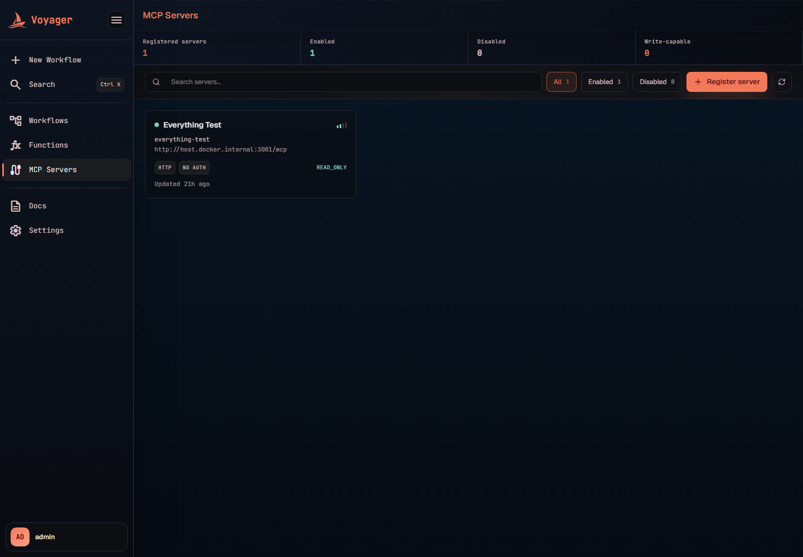
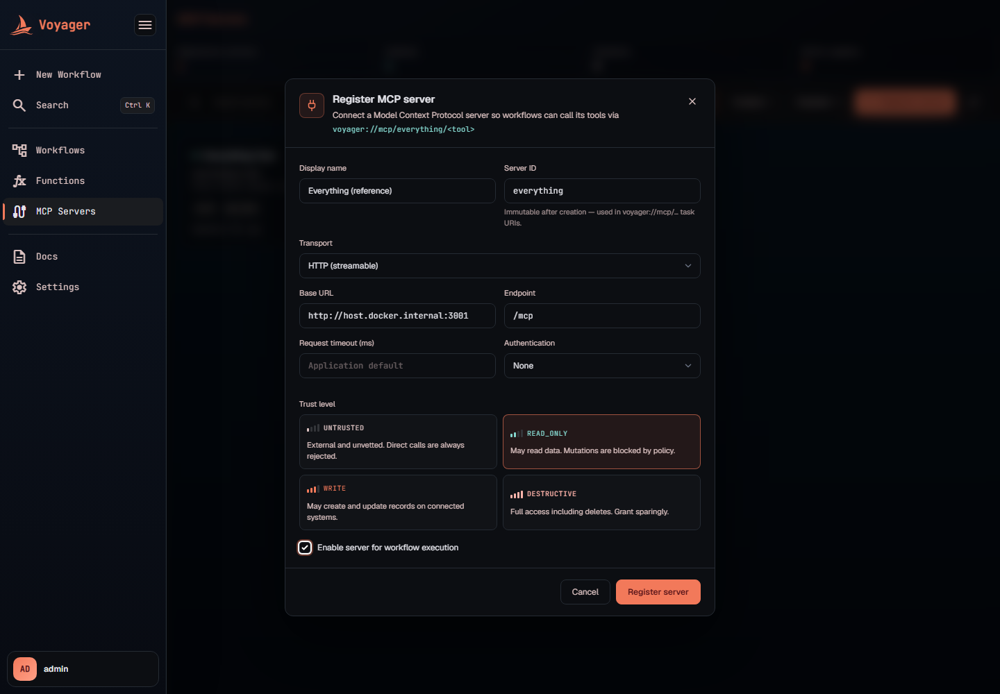
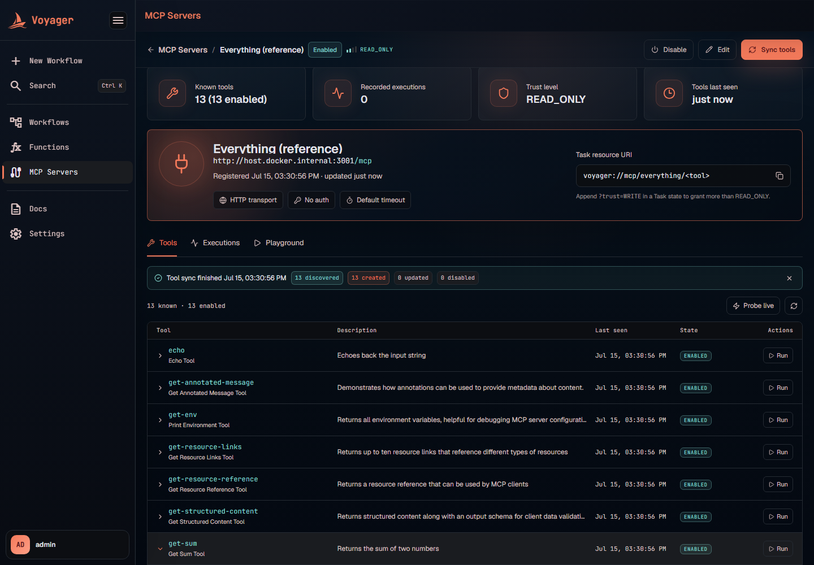
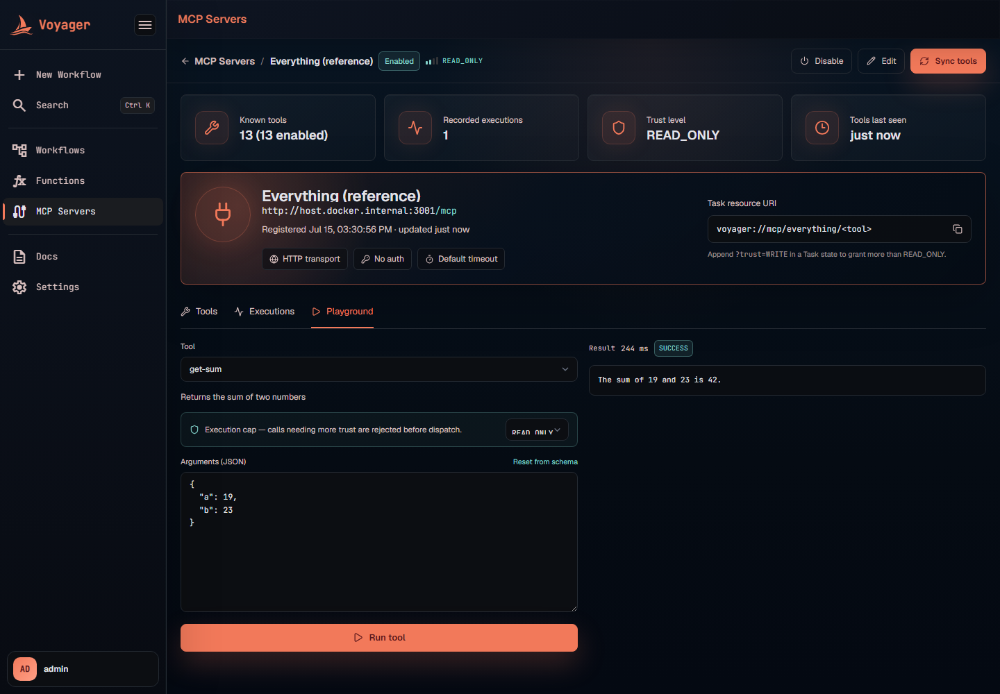
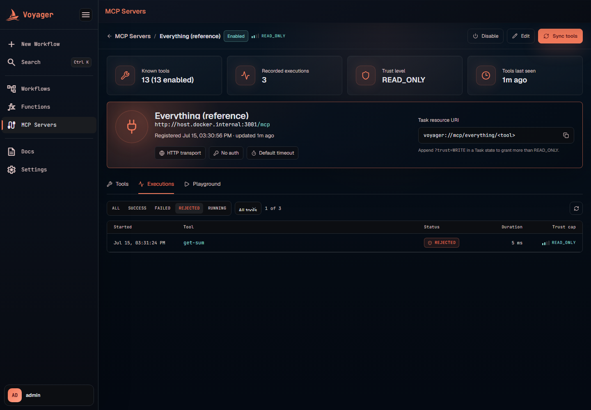
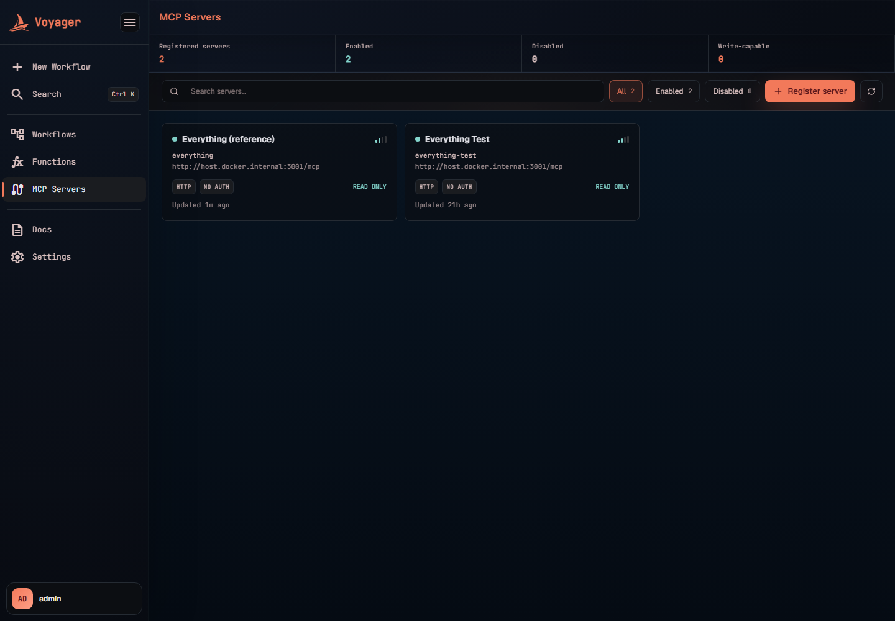

# MCP Servers

Voyager is a Model Context Protocol (MCP) **client**: you register external MCP servers, Voyager discovers and catalogs the tools they advertise, and workflows call those tools as Task states — with every call passing a trust gate and leaving an audit record. This turns third-party capabilities (GitHub, CRMs, internal services, anything speaking MCP) into schedulable, retryable workflow steps without writing integration code.

This guide covers the whole surface: registering servers over HTTP or STDIO, authentication and secret handling, the tool catalog and sync, the trust ladder and how it gates execution, the playground, the execution audit trail, and calling tools from workflows.

- [How an MCP call works](#how-an-mcp-call-works)
- [Concepts: servers, tools, executions](#concepts-servers-tools-executions)
- [The trust ladder](#the-trust-ladder)
- [Registering a server](#registering-a-server)
- [Authentication and secrets](#authentication-and-secrets)
- [The tool catalog and sync](#the-tool-catalog-and-sync)
- [The playground](#the-playground)
- [The execution audit trail](#the-execution-audit-trail)
- [Using MCP tools in workflows](#using-mcp-tools-in-workflows)
- [Attribute reference](#attribute-reference)
- [Error names reference](#error-names-reference)
- [HTTP API reference](#http-api-reference)
- [Operator configuration](#operator-configuration)

## How an MCP call works

Every call — from a workflow Task, the playground, or the API — follows the same path:

```text
caller (workflow Task / playground / API)
  ──► trust gate            server enabled? tool known+enabled? server trust ≤ caller's cap?
  ──► pooled MCP client     one initialized client per server, reused across calls
  ──► tools/call            over streamable HTTP or a spawned STDIO process
  ──► result                content blocks (+ structuredContent) recorded and returned
```

Two properties are worth internalizing:

1. **The trust gate runs before dispatch.** A call that asks for more trust than the caller granted is rejected *without touching the server*, and the rejection itself is recorded as a `REJECTED` execution.
2. **Every call is recorded.** Success, failure, or rejection — the executions log is the audit trail for anything Voyager asked an external server to do.

Clients are pooled per server so repeat calls skip the connect + initialize handshake; a pooled client is rebuilt when the server's connection settings change and evicted on any error, so a dropped session heals on the next call.

## Concepts: servers, tools, executions

| Record | What it is |
|---|---|
| **Server** | A registered MCP endpoint: `serverId` (immutable, used in task URIs), display name, transport + connection details, auth config, **trust level**, and status (`ENABLED` / `DISABLED`). |
| **Tool** | A catalog entry synced from the server: name, title, description, JSON input/output schemas, an `enabled` flag, and `lastSeenAt`. Workflows can only reference tools that exist in this catalog. |
| **Execution** | One recorded call: arguments, result, status (`RUNNING` / `SUCCESS` / `FAILED` / `REJECTED`), the trust cap the caller granted, error message, and timing. |

A `DISABLED` server rejects everything — tool listing, sync, playground calls, and workflow calls all fail with "MCP server is disabled" until it is enabled again.

## The trust ladder

Trust is the centerpiece of the MCP integration. Each server carries one of four levels describing the worst thing its tools can do:

| Level | Meaning (as shown in the UI) |
|---|---|
| `UNTRUSTED` | External and unvetted. **Direct calls are always rejected.** |
| `READ_ONLY` | May read data. Mutations are blocked by policy. |
| `WRITE` | May create and update records on connected systems. |
| `DESTRUCTIVE` | Full access including deletes. Grant sparingly. |

Enforcement has three rules:

1. **`UNTRUSTED` servers never execute.** Registration defaults to `UNTRUSTED` + `DISABLED`, so a freshly added server is quarantined until someone deliberately promotes it.
2. **Callers grant a cap, not the server.** Every call carries a *maximum allowed trust level* — the playground's "Execution cap" selector, a workflow's `?trust=` parameter, or the API's `maxAllowedTrustLevel` field. When omitted, the cap defaults to `READ_ONLY`.
3. **The server's trust must fit under the cap.** A `WRITE` server called with a `READ_ONLY` cap is rejected before dispatch: `MCP server trust level WRITE exceeds allowed level READ_ONLY`, recorded as `REJECTED`, and surfaced to workflows as `States.Permissions`.

One consequence reaches into the workflow runtime itself: **mutating MCP calls are never auto-retried.** For a Task whose resource grants `WRITE` or `DESTRUCTIVE`, the interpreter ignores the state's `Retry` configuration — a failure may have landed *after* the side effect happened on the remote server, and a retry could duplicate it (create the record twice, delete the next thing). `Catch` still applies, so the workflow can route the failure; the same suppression applies to Parallel/Map re-fork retries when a branch contains a mutating MCP task. Read-only MCP calls retry normally.

## Registering a server

Open **MCP Servers** in the sidebar. The overview shows metric tiles (registered / enabled / disabled / write-capable), status filters, search, and a card per server with its transport, auth, and trust badges.



Click **Register server**:



| Field | Rules | Notes |
|---|---|---|
| **Display name** | required | Human label on cards and the detail page. |
| **Server ID** | required, `^[a-z0-9][a-z0-9-]*$` | **Immutable after creation** — it is the URI segment in `voyager://mcp/<serverId>/<tool>`. |
| **Transport** | `HTTP (streamable)` or `STDIO` | HTTP for remote servers; STDIO spawns a local child process speaking MCP over stdin/stdout. |
| **Base URL** + **Endpoint** | required for HTTP; absolute URL + path starting with `/` | e.g. `http://host.docker.internal:3001` + `/mcp`. |
| **Command**, **Arguments**, **Environment** | command required for STDIO | One argument per line; env as `KEY=VALUE` per line. The command must be resolvable *in the backend's environment* — if Voyager runs in a container, the runtime (Node, Python, …) must exist in the image, or use HTTP instead. The client checks this up front and fails with an actionable message rather than a generic timeout. |
| **Request timeout (ms)** | positive; blank = application default (30 s) | Per-request budget for this server. |
| **Authentication** | `None` / `Bearer token` / `API key` / `Basic` | See [Authentication and secrets](#authentication-and-secrets). |
| **Trust level** | defaults to `UNTRUSTED` | Pick deliberately — this is the ceiling on what the server's tools are allowed to do. |
| **Enable server for workflow execution** | defaults to off | Until checked (or the status is set to `ENABLED`), nothing can call the server. |

## Authentication and secrets

Secrets are never stored in Voyager's database. Authenticated servers persist only a **token reference** (`authTokenRef`, e.g. `MCP_GITHUB_TOKEN`); the secret itself lives in the deployment tier and is resolved at connect time:

- Inline value: property `scheduler.mcp.tokens.MCP_GITHUB_TOKEN` (environment variable `SCHEDULER_MCP_TOKENS_MCP_GITHUB_TOKEN`), or
- File path: property `scheduler.mcp.token-files.MCP_GITHUB_TOKEN` pointing at a mounted secret file. The file is read fresh on every resolve, so a rotated Docker/Kubernetes secret is picked up without a restart. The file variant wins when both are set.

How each auth type uses the resolved token:

| Auth type | HTTP behavior | STDIO behavior | Extra fields |
|---|---|---|---|
| `NONE` | no auth | no auth | — |
| `BEARER_TOKEN` | `Authorization: Bearer <token>` | token injected into the child process env var named by **Auth env var** | `authTokenRef` (+ `authEnvVar` for STDIO) |
| `API_KEY` | `<Header name>: <token>` | HTTP only | `authTokenRef`, `authHeaderName` |
| `BASIC` | `Authorization: Basic base64(username:token)` | HTTP only | `authTokenRef`, `authUsername` |

Use an `UPPER_SNAKE_CASE` ref so it maps cleanly onto an environment variable name.

## The tool catalog and sync

Workflows can only call tools Voyager *knows about*, so after registering (and whenever a server's toolset changes), sync the catalog. **Sync tools** fetches the server's live tool list and reconciles it into the database — the banner reports what changed, and each tool row expands to show its JSON input/output schemas:



Sync semantics:

- Newly advertised tools are **created**, changed ones **updated**, and tools the server no longer advertises are **disabled** (not deleted — history stays intact). `lastSeenAt` tracks freshness.
- **Probe live** fetches the server's current list *without* persisting anything — useful for checking connectivity.
- A background scheduler re-syncs every enabled server (default: every 15 minutes, first run 60 s after startup) so the catalog can't silently drift. Each server syncs independently; one unreachable server is logged and skipped without stalling the rest.

## The playground

The Playground tab runs any enabled tool ad-hoc — the fastest way to check what a tool actually returns before wiring it into a workflow. Pick a tool (the arguments editor pre-fills a template from the input schema — "Reset from schema" restores it), choose the **execution cap**, and run:



The result pane shows the outcome, duration, and the returned content blocks (plus structured content when the tool declares an output schema). The execution-cap selector is the same trust gate workflows use — set it below the server's trust level and the call is rejected before dispatch, exactly as a workflow's would be. Every playground call is recorded under Executions.

## The execution audit trail

The Executions tab lists every recorded call against the server — playground, API, and workflow-triggered alike. Rows can be filtered by status and by tool, and each shows the tool, outcome, duration, and the trust cap the caller granted; expanding a row reveals the full arguments and the result or error payload. Here the `REJECTED` filter isolates the call that was blocked by the trust gate:



The four statuses:

| Status | Meaning |
|---|---|
| `RUNNING` | Dispatched, awaiting the server's response. |
| `SUCCESS` | Completed; result recorded. |
| `FAILED` | The server errored or the call failed in flight. |
| `REJECTED` | Blocked by the trust gate before dispatch — the audit row records the attempted arguments and the violated policy. |

## Using MCP tools in workflows

Reference a tool from a Task state as `voyager://mcp/<serverId>/<toolName>`, optionally granting trust above the `READ_ONLY` default with `?trust=`:

```json
{
  "AddNumbers": {
    "Type": "Task",
    "Resource": "voyager://mcp/everything/get-sum?trust=READ_ONLY",
    "Arguments": {
      "a": "",
      "b": ""
    },
    "Catch": [
      {
        "ErrorEquals": ["States.Permissions"],
        "Next": "HandleTrustRejection"
      },
      {
        "ErrorEquals": ["Mcp.ToolFailed", "Mcp.ToolNotFound"],
        "Next": "HandleToolFailure"
      }
    ],
    "End": true
  }
}
```

- The evaluated `Arguments` become the tool-call arguments; the tool's result content becomes `$states.result` (e.g. `{"content": [{"type": "text", "text": "The sum of 34 and 55 is 89."}]}`).
- `?trust=` accepts `READ_ONLY`, `WRITE`, or `DESTRUCTIVE` — never `UNTRUSTED`. Omitting it grants `READ_ONLY`, so a workflow must *opt in* to reach a mutating server.
- Remember the runtime rule: if the resource grants `WRITE` or `DESTRUCTIVE`, the state's `Retry` block is ignored (no automatic retry of possibly-committed side effects); design mutating states with `Catch` routes instead.

**Save-time validation.** Saving or activating a workflow validates every MCP resource: the URI must parse (including a known, grantable trust level), the server must be registered, and the tool must exist in the synced catalog — failing with `MCP_RESOURCE_INVALID`, `MCP_SERVER_NOT_FOUND`, or `MCP_TOOL_NOT_FOUND` ("sync the server's tools first") right in the editor. The checks recurse into Parallel branches and Map item processors. Runtime keeps its own guards for drift after activation (a server disabled later, a tool removed by a subsequent sync).

## Attribute reference

### Server

| Attribute | Default | Notes |
|---|---|---|
| `serverId` | — | Required, immutable, `^[a-z0-9][a-z0-9-]*$`; the URI segment. |
| `displayName` | — | Required. |
| `transport` | — | `HTTP` (streamable) or `STDIO`. |
| `baseUrl` / `endpoint` | — | HTTP only; absolute URL / path starting with `/`. |
| `command` / `args` / `env` | — | STDIO only; command must resolve in the backend's environment. |
| `authType` | — | `NONE`, `BEARER_TOKEN`, `API_KEY`, `BASIC`. |
| `authTokenRef` | — | Required for any authenticated type; forbidden for `NONE`. A reference, never the secret. |
| `authEnvVar` | — | Required for STDIO + `BEARER_TOKEN` (env var that receives the token). |
| `authHeaderName` | — | Required for `API_KEY`. |
| `authUsername` | — | Required for `BASIC`. |
| `trustLevel` | `UNTRUSTED` | The server's capability ceiling. |
| `status` | `DISABLED` | Only `ENABLED` servers accept any operation. |
| `requestTimeoutMs` | app default (30 000) | Per-request budget. |

### Tool (synced, read-only)

`toolName`, `title`, `description`, `inputSchema` (jsonb), `outputSchema` (jsonb, optional), `enabled`, `lastSeenAt` — maintained exclusively by sync.

## Error names reference

MCP Task failures map to the stable error vocabulary workflows match in `Retry`/`Catch`:

| Error name | Raised when | Retry advice |
|---|---|---|
| `States.Permissions` | Trust rejection (server `UNTRUSTED`, or server trust exceeds the granted cap) | Don't retry — raise the grant or lower the server's trust deliberately. |
| `Mcp.ToolNotFound` | Server or tool missing at run time | Don't retry — usually drift; re-sync or fix the reference (save-time validation catches the authoring case). |
| `Mcp.ToolFailed` | The tool executed and failed, or the call failed in flight | Retryable **only** for `READ_ONLY` grants; mutating grants never auto-retry. |
| `States.TaskFailed` | Malformed resource URI or invalid arguments | Don't retry — authoring error. |

## HTTP API reference

Base path: `/app/v1/mcp/servers`

| Method & path | Purpose |
|---|---|
| `POST /` | Register a server. |
| `GET /?status=` | List servers, optionally filtered by status. |
| `GET /{serverId}` | Get one server. |
| `PUT /{serverId}` | Update a server (serverId immutable). |
| `PATCH /{serverId}/status` | Enable/disable. |
| `GET /{serverId}/tools` | Live tool list from the server (no persistence). |
| `GET /{serverId}/tools/known?enabledOnly=` | The synced catalog. |
| `POST /{serverId}/tools/sync` | Sync the catalog; returns discovered/created/updated/disabled counts. |
| `POST /{serverId}/tools/{toolName}/call` | Execute a tool (`arguments`, optional `maxAllowedTrustLevel`; default cap `READ_ONLY`). |
| `GET /{serverId}/executions?toolName=` | The audit trail, optionally filtered by tool. |

## Operator configuration

| Setting | Default | Meaning |
|---|---|---|
| `scheduler.mcp.request-timeout-ms` | `30000` | Default per-request timeout when a server doesn't override it. |
| `scheduler.mcp.tool-sync-delay-ms` | `900000` (15 min) | Background catalog re-sync interval for enabled servers. |
| `scheduler.mcp.tool-sync-initial-delay-ms` | `60000` | Delay before the first background sync after startup. |
| `scheduler.mcp.tokens.<REF>` | — | Inline secret for a server whose `authTokenRef` is `<REF>` (env: `SCHEDULER_MCP_TOKENS_<REF>`). |
| `scheduler.mcp.token-files.<REF>` | — | Path to a mounted secret file for `<REF>`; re-read on every resolve, wins over the inline value. |

The app exposes an `mcp` health indicator at `/actuator/health` reporting the number of enabled servers and, per server, its known-tool count and the most recent `lastSeenAt` — a quick way to spot a catalog that stopped syncing.


