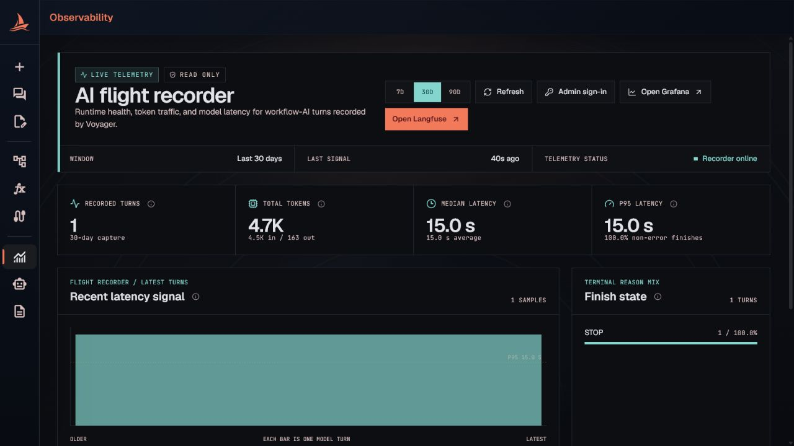
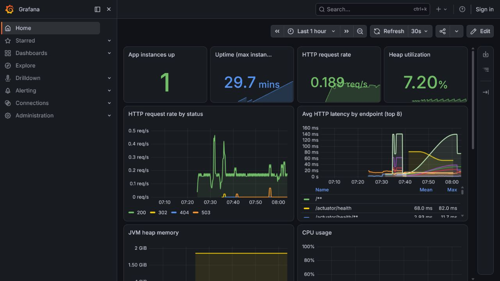

# AI Observability

Voyager exposes observability through a native workflow-AI dashboard, a pre-provisioned **Grafana**
runtime dashboard backed by Prometheus and Loki, and a self-hosted **Langfuse** trace stack. Open the
native dashboard from **Observability** in the sidebar (`/observability`, directly above
[AI Settings](ai-models.md)). It reads Voyager's own tables, Grafana covers application metrics and
logs, and Langfuse adds full per-span AI trace inspection.

- [What counts as a turn](#what-counts-as-a-turn)
- [The dashboard](#the-dashboard)
- [Time window](#time-window)
- [Grafana runtime dashboard](#grafana-runtime-dashboard)
- [Langfuse tracing](#langfuse-tracing)
- [HTTP API](#http-api)

## What counts as a turn

A **recorded turn** is one persisted final assistant response. A single turn can involve several
model calls — an initial generation, an optional function-review pass, up to two repair passes, and
catalog-search / ASL-validation tool calls — but those internal steps do not each count as a turn.
Token totals sum every pass; use Langfuse to inspect the individual spans inside a turn. See
[AI Workflow Generator — Live turn progress](ai-workflows.md#live-turn-progress).

## The dashboard

The Observability page summarizes activity in the selected [time window](#time-window):

| Metric | Meaning |
|---|---|
| **Recorded turns** | Final assistant responses in the window. |
| **Total tokens** | Provider-reported input + output tokens, with the in/out split. |
| **Median latency** | P50 end-to-end response time, with the arithmetic average alongside. |
| **P95 latency** | The time 95% of turns completed within, plus the share of non-error finishes. |

Below the tiles:

- **Recent latency signal** — a bar per recent turn against the p95 line.
- **Finish state** — the mix of provider finish reasons. `STOP` is normal completion; `LENGTH` hit a
  limit; `TOOL_CALLS` requested tools; `ERROR` / `FAILED` / `CANCELLED` need attention.
- **Model traffic** — turns, token volume, and average latency grouped by model.
- **Latest turns** — the most recent turns with timestamp, model, latency, tokens, and finish reason.

Summary metrics are computed over up to 10,000 turns in the window; the latency signal and Latest
turns table show at most the most recent 20. The non-error percentage measures technical completion
only, not answer quality. The panel is strictly read-only.

## Time window

The **7D / 30D / 90D** switch selects a rolling period ending now — not calendar weeks or months. A
turn is included when it was created within the last 7, 30, or 90 days. **Refresh** re-pulls the
current window.

## Grafana runtime dashboard

Select **Open Grafana** on the Observability page or open `http://<host>:3300`. Docker Compose
provisions Prometheus and Loki as Grafana datasources and opens the bundled **Voyager · Spring Boot
runtime** dashboard by default. It covers application availability and uptime, HTTP traffic and
latency, JVM memory and CPU, garbage collection, Kafka consumer lag, and the HikariCP connection
pool. Container logs collected by Alloy and stored in Loki are searchable from the bundled **Voyager · Logs** dashboard (service selector, throughput, and a live log stream), or ad hoc through Grafana's Explore view.

The Compose defaults enable anonymous Grafana admin access for local development. Disable or
restrict anonymous access before exposing Grafana beyond a trusted machine.

## Langfuse tracing

Voyager ships a self-hosted **Langfuse v4** stack in Docker Compose and sends one OTLP trace per AI
turn (a trace with a linked generation observation). Langfuse being slow or unreachable never affects
a turn — tracing is best-effort and out of the request path.

Open Langfuse from the **Open Langfuse** button on the Observability page (`http://<host>:3100`).
Langfuse cannot be embedded in an iframe (X-Frame-Options plus cross-origin cookies), so it opens in a
new tab. The page's **Admin sign-in** control shows the Docker-default credentials:

| Field | Default | Override |
|---|---|---|
| Email | `admin@voyager.local` | `LANGFUSE_INIT_USER_EMAIL` |
| Password | `voyager-admin` | `LANGFUSE_INIT_USER_PASSWORD` |

When the init variables are overridden, sign in with the configured values instead.

Langfuse v4 runs in an events-only mode that disables the legacy `/api/public/traces` route; read
recorded activity programmatically through `GET /api/public/v2/observations` instead.

Cost is not shown for local models: Ollama and other local models are not in Langfuse's price table.
The infrastructure supports cost for priced cloud models.

## HTTP API

| Method and path | Purpose |
|---|---|
| `GET /app/v1/ai/observability/metrics?days=<7\|30\|90>` | Aggregated turn telemetry for the native dashboard — totals, latency percentiles, finish reasons, per-model traffic, and recent turns. |

The metrics endpoint reads Voyager's persisted per-turn telemetry directly and needs no Langfuse API.
