# Workflows

A Voyager workflow is a durable state machine written in [ASL with JSONata](asl-jsonata.md): a set of states (Task, Choice, Wait, Parallel, Map, …) that the runtime executes step by step, persisting every transition to PostgreSQL so a run survives restarts, retries, and node failures (see [interpreter internals](interpreter.md) for how). Workflows run on a cron schedule, on demand with a JSON input, or both — and their Task states call [functions](functions.md), [MCP tools](mcp.md), webhooks, and email.

This guide covers the product surface: creating a workflow (AI-assisted or manual), validating and test-driving it before saving, the revision model, scheduling and lifecycle, and running and inspecting executions.

- [Concepts: workflows, revisions, executions](#concepts-workflows-revisions-executions)
- [Creating a workflow](#creating-a-workflow)
  - [Path 1: the AI Generator](#path-1-the-ai-generator)
  - [Path 2: Manual ASL](#path-2-manual-asl)
  - [Validation](#validation)
  - [Test states before saving: the draft test bench](#test-states-before-saving-the-draft-test-bench)
  - [Metadata and saving](#metadata-and-saving)
- [The workflow detail page](#the-workflow-detail-page)
- [Revisions](#revisions)
- [Scheduling and lifecycle](#scheduling-and-lifecycle)
- [Executions](#executions)
- [Task resources](#task-resources)
- [HTTP API reference](#http-api-reference)
- [Operator configuration](#operator-configuration)

## Concepts: workflows, revisions, executions

| Record | What it is |
|---|---|
| **Workflow** | The named container: status, cron expression + timezone, workflow-level `maxAttempts`, `nextRunAt`, and a pointer to the **active definition revision**. Carries an optimistic-lock `version` (metadata edits require the expected version) and an idempotency key (re-submitting the same create request returns the existing workflow). |
| **Definition revision** | An immutable, numbered snapshot of the ASL JSON. Definitions are canonicalized (key-sorted, SHA-256 hashed) — saving byte-different-but-equivalent JSON maps to the existing revision instead of minting a new one. Only the canvas layout (node positions) stays editable. |
| **Execution** | One run: sequential `runNumber`, input/output, status, and the full persisted trace (scopes → state visits → Task attempts). Manual vs. scheduled is inferred from whether the run has a `scheduledFor` timestamp. |

Statuses:

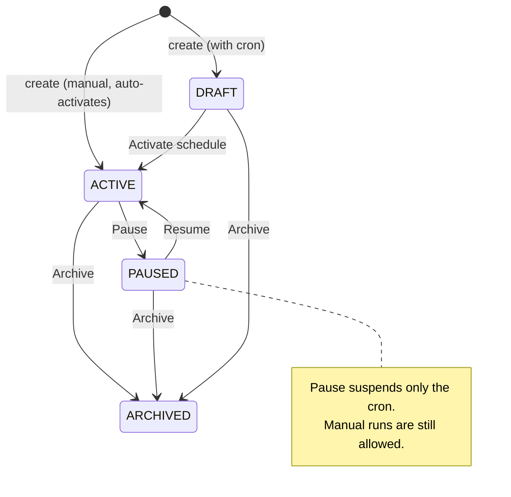

Two behaviors worth internalizing up front:

- **Manual (cron-less) workflows are never really DRAFT** — creating one, or saving a new revision on one, activates it immediately. DRAFT exists for *recurring* workflows awaiting an explicit "Activate schedule".
- **Execution statuses**: `PENDING → QUEUED/RUNNING/WAITING →` one of `SUCCEEDED / FAILED / CANCELED / TIMED_OUT`.

The Workflows page lists everything with status chips, schedule (`cron - timezone` or "Trigger-based"), and the next scheduled run:

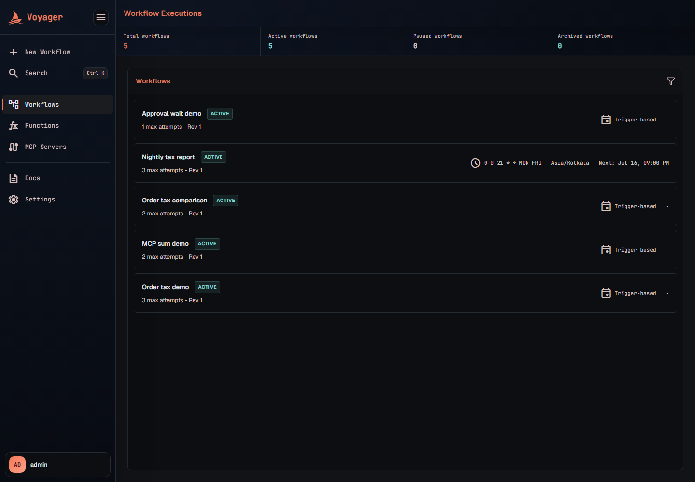

## Creating a workflow

**New Workflow** in the sidebar (or `/`) opens the creator. Two paths share the same underlying editor and validation.

### Path 1: the AI Generator

Describe the workflow in plain language. The first successful turn creates a durable conversation at
`/c/<conversationId>`, opens the generated ASL in the manual editor, and keeps the assistant beside
the canvas for follow-up changes. The **Chats** section in the main sidebar lists and searches old
conversations; reopening one restores both user and assistant messages, the latest valid ASL, moved
canvas nodes, and workflow settings. Merely viewing a chat does not change its last-updated time.

The model receives the current editor definition and a live Task catalog containing built-in system
resources, enabled published functions, and enabled synced MCP tools. Long conversations keep recent
turns verbatim and compact older turns into a source-grounded summary without deleting the original
messages. **Retry** is intentionally available only for the latest assistant response.

A stage strip tracks the conversation through **Details → ASL ready → Reviewing → Schedule → Ready
→ Accepted**. You can edit the JSON directly, ask the model to review it against the original request,
and finally accept the workflow, which creates it server-side and opens its detail page. The complete
model setup, persistence, context, summarization, retry, and API behavior is documented in
[AI Workflow Generator](ai-workflows.md).


The AI path needs at least one model endpoint configured (the model picker's **+** opens Settings;
local Ollama/llama.cpp/vLLM endpoints and OpenAI-compatible cloud providers are supported). Provider
keys are entered as values and stored encrypted, never as secret-reference names. The two tiles below
the composer also matter for the manual path: **Import from template** loads an ASL JSON file straight
into the manual editor, and **Explore examples** offers ready-made prompts.

### Path 2: Manual ASL

Switch the top-right toggle to **Manual ASL** (or just import a file — importing switches
automatically). Switching modes alone stays on `/` and does not create an empty draft. When the first
state is added—through the builder, code editor, or an imported definition—Voyager creates
`/draft/<draftId>` and continuously saves the exact definition editor text, canvas positions, and
workflow settings. Incomplete JSON is restored exactly after refresh while the last valid ASL remains
protected. The **Drafts** sidebar below Chats supports search, reopen, rename, delete, and delete all.

Use the pencil action on any Chat or Draft sidebar row to give it a memorable custom name. That name
is searchable, survives refresh, and does not change the workflow name stored in draft settings.

Opening AI from a manual draft attaches the messages and selected model to the same draft. The route
stays `/draft/<draftId>` and the workspace does not create a separate `/c/<conversationId>`. Saving
the workflow removes the manual draft and opens `/workflows/<workflowId>`.

The editor has two views:

- **Builder** — a canvas with a palette of all eight state types. Adding a state drops a sensible template (a new Task starts with a placeholder `voyager://` resource, which intentionally fails validation until you pick a real one); the first state becomes `StartAt`. Drag between nodes to connect transitions, right-click nodes for *Set as start* / *Delete state*, right-click edges to disconnect or mark a Choice default. Renaming a state rewires every transition that targets it; deleting one converts referrers to `End: true`.


- **Code** — a Monaco JSON editor with a live canvas preview beside it, for editing the definition directly:

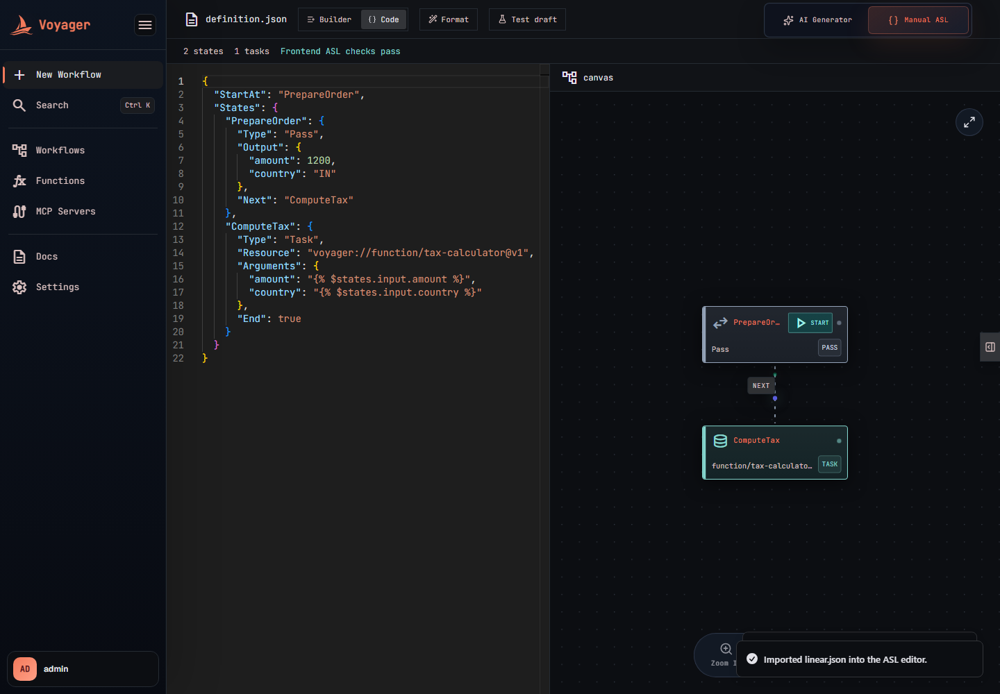

Clicking a state opens the **State inspector** with type-specific sections — Task (resource picker + arguments + timeout/heartbeat), Choice rules, Wait, Parallel branches, Map, plus shared **Transition**, **Data flow** (`Assign`/`Output`), and **Error handling** (`Retry`/`Catch`) sections. The Task resource picker is fed live from the registries: your published [functions](functions.md) (`voyager://function/name@vN`), enabled [MCP tools](mcp.md) (`voyager://mcp/server/tool`), and the built-in system resources (webhook, send-email). Parallel branches and Map item processors open as nested canvases with their own scope breadcrumb.

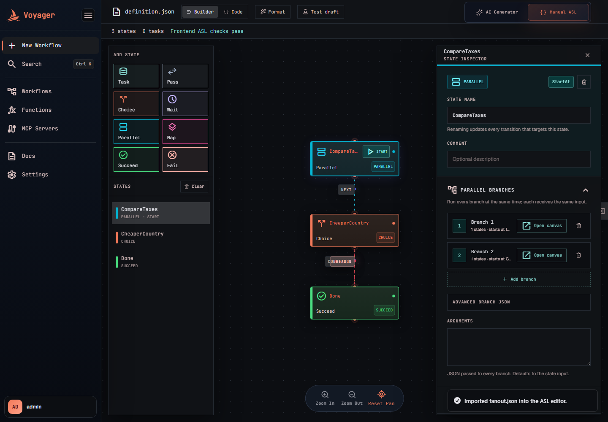

### Validation

The editor continuously validates: a status pill in the toolbar reads **"Frontend ASL checks pass"** when clean, or **"N ASL validation issue(s)"** — hover it for the full list with `$`-rooted locations. The client-side checks mirror the server's validators (structure, graph reachability, JSONata field placement, runtime support — the same rules documented in [ASL with JSONata](asl-jsonata.md)); the server re-runs everything on save and activation, including the registry checks that MCP servers/tools exist and referenced functions are published.

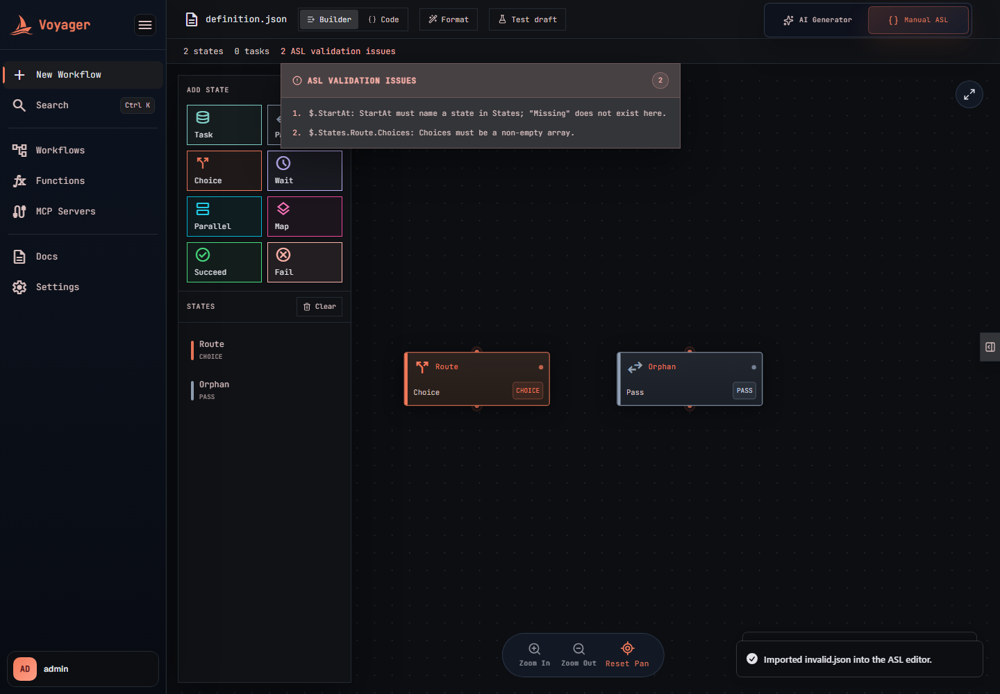

### Test states before saving: the draft test bench

**Test draft** opens a bench that runs *individual states of the unsaved definition* against sample input — nothing is added to execution history. Pick a state, provide input JSON, and run:

- Task states default to a **preview**: the resource URI and fully evaluated `Arguments` are returned without calling anything. The output pane is editable, so you can mock the task result and chain onward with **Use as next input**. Ticking **Allow task side effects** genuinely invokes the resource (real function/MCP/webhook call) and then applies `Assign`/`Output` to the real result.
- Wait states return the computed `wakeAt`; Choice/Pass/Succeed/Fail run for real. Parallel and Map previews aren't supported yet.

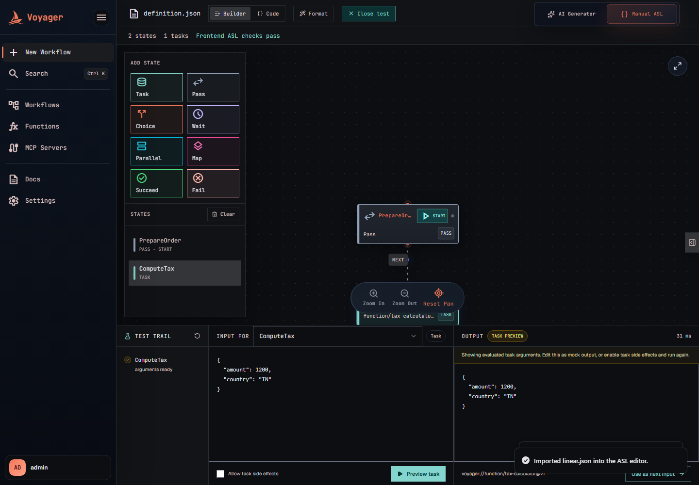

### Metadata and saving

The right panel (click the edge handle if collapsed) holds **Workflow settings**: name, workflow-level attempts, and the schedule builder — **Manual** ("runs only when triggered") or **Recurring** with a frequency picker (minutes/hourly/daily/weekly/monthly) that compiles to a cron. Under **Advanced**: the raw cron expression — **six fields, seconds first** (`second minute hour day month weekday`, Spring format) — the timezone (IANA zones; shown only for recurring), and the auto-generated idempotency key.

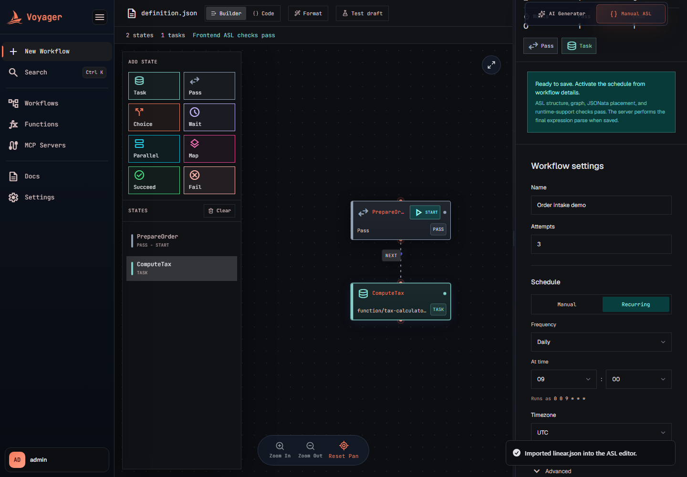

**Save workflow** validates server-side, creates the workflow with definition revision 1, and navigates to the detail page. A manual workflow is immediately `ACTIVE`; a recurring one lands as `DRAFT` with an **Activate schedule** button in the header — activation computes the first `nextRunAt` in the workflow's timezone:

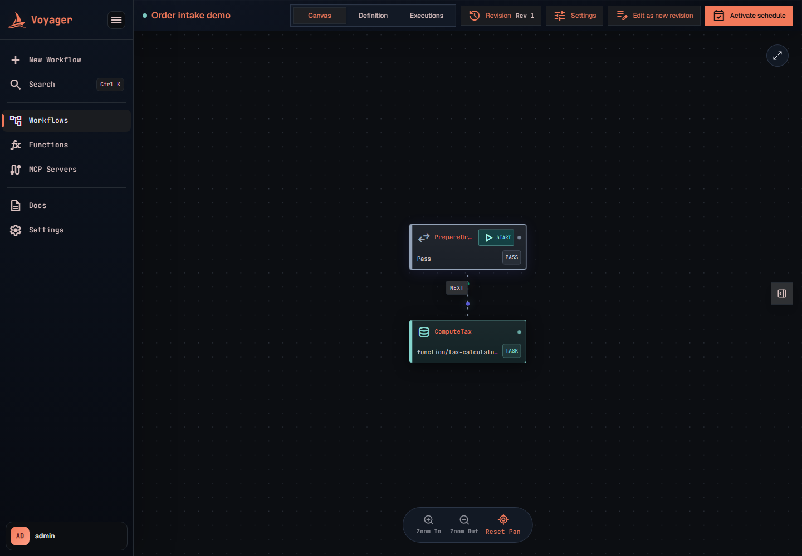

## The workflow detail page

Three tabs: **Canvas** (the definition as a graph, with a per-state details rail), **Definition** (read-only JSON), and **Executions** (below). The header carries the revision selector, **Settings** (lifecycle drawer), **Edit as new revision**, and the status-dependent primary action (**Activate schedule** for cron drafts; **Execute** for active/paused workflows, which jumps to the Executions tab).

## Revisions

Definitions are immutable — changing one means creating the next numbered revision:

1. **Edit as new revision** opens the builder seeded with the selected revision (`revision-N.json`, "New revision" badge). Name, schedule, and attempts are *not* edited here — they belong to the workflow, not the revision.
2. Saving offers two semantics for recurring workflows: **Save & activate** (new runs use it immediately) or **Save revision** (stays inactive until you activate it). Manual workflows activate new revisions immediately.
3. Activation re-validates the definition — including the function/MCP registry checks — so a revision referencing a since-archived function cannot become active.

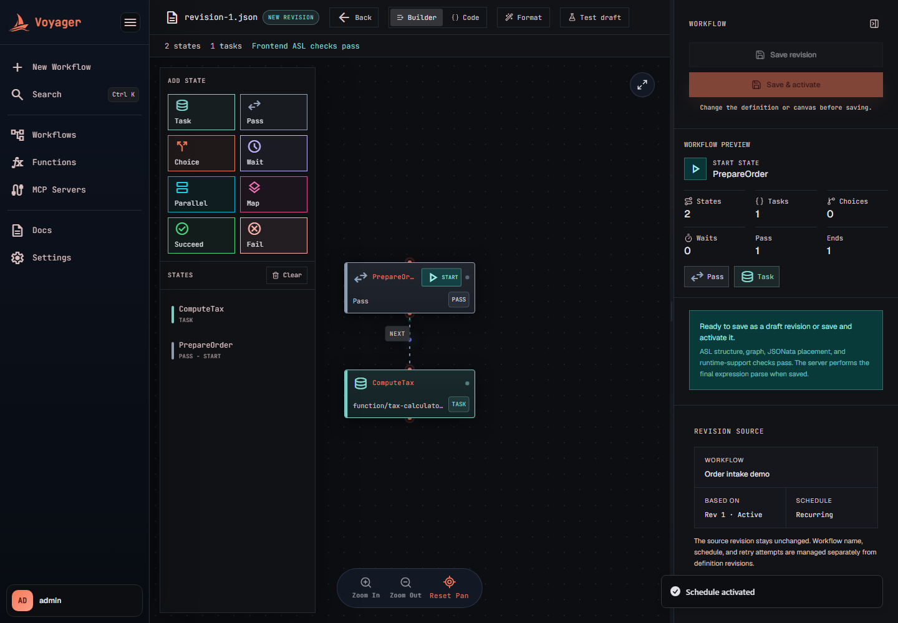

The **Revision** panel lists every revision with its definition hash and an **Active** badge; selecting one changes what the Canvas/Definition tabs display (and what "Activate schedule" would activate). Existing executions always remain pinned to the revision they ran with.

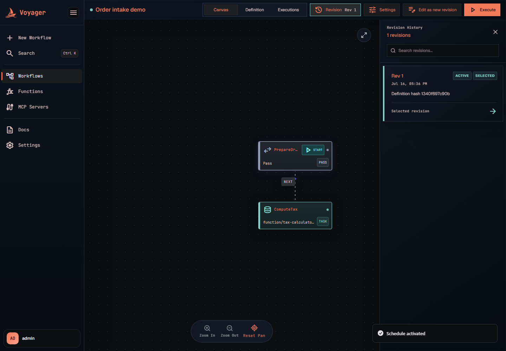

## Scheduling and lifecycle

**How the cron scheduler works:** a poller claims due `ACTIVE` workflows with `FOR UPDATE SKIP LOCKED` (multi-node safe), creates one execution per occurrence (unique on workflow + occurrence time, so two scheduler nodes can't double-fire), and advances `nextRunAt` **from the previous occurrence, not from now** — a workflow that was down catches up by materializing each missed occurrence one poll at a time rather than silently skipping to the future.

The **Settings** drawer manages everything mutable on the workflow: name, attempts, the trigger policy (the same schedule builder as creation — clearing the cron converts to manual, adding one to an active workflow starts scheduling immediately), and lifecycle:

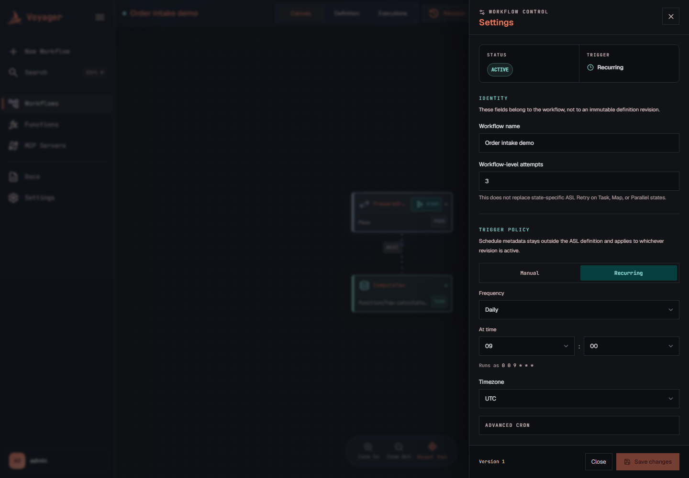

- **Pause schedule** stops future scheduled runs and clears `nextRunAt` — but **manual runs stay allowed**; pause only suspends the cron. **Resume** re-validates the active definition and recomputes `nextRunAt`.

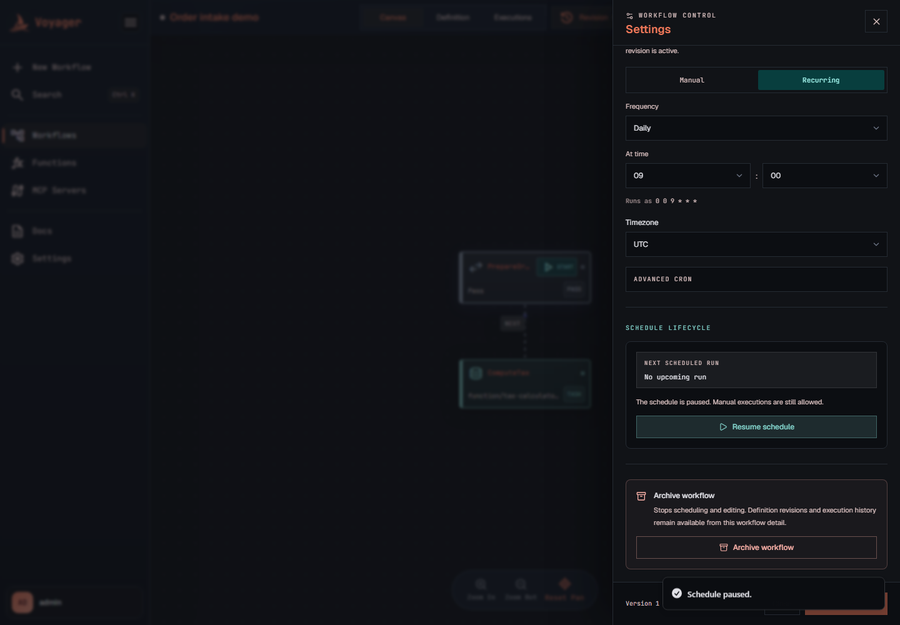

- **Archive workflow** is terminal: no more runs or edits, but revisions and execution history remain browsable. (In-flight executions continue independently.)
- Saves send the workflow's `version` as `expectedVersion`; if someone else changed it concurrently you get a conflict, the drawer reloads the latest values, and asks you to review before saving again.

## Executions

The **Executions** tab is a two-pane view: the run list (searchable by exact execution ID or run number, filterable by status / trigger / revision, 20 per page, auto-polling while anything is active) and the **execution trace**.

**Trigger run** starts a manual execution with a JSON input (this is the `$states.input` of the `StartAt` state):

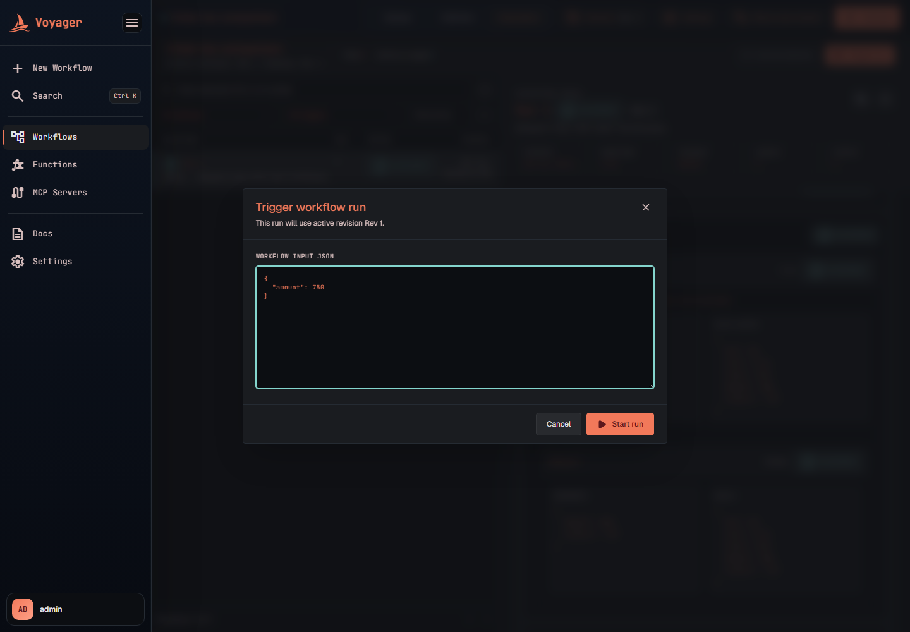

Manual starts run **inline**: fast workflows (Pass/Choice chains) return their final output in the same request, while workflows that dispatch a Task or hit a Wait suspend and continue asynchronously — so a new run may already read `SUCCEEDED` the moment it appears.

The trace renders the full persisted tree: metric cards (duration, trigger, scope/state counts), then one card per **scope** — "Root workflow", "Parallel branch N", "Map iteration N" — each listing its state visits with status, duration, resource, input/output JSON, and for Task states the **attempts** (arguments, result, worker, retry timing). A raw-JSON toggle exposes the exact API payload.


**Cancellation** is available for any run still in `PENDING/QUEUED/RUNNING/WAITING`. It is **cooperative**: the execution and all its active scopes/states/attempts are atomically marked `CANCELED` so nothing advances further and late worker results are ignored — but a Task already executing in a worker isn't interrupted, and its external side effects are not rolled back. Cancel is idempotent and a no-op on already-terminal runs; canceled runs report error `Execution.Canceled`.

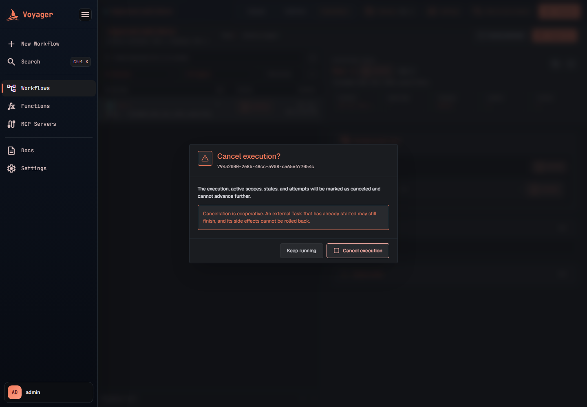

Two more run-level behaviors:

- A top-level `TimeoutSeconds` in the definition becomes the execution deadline; a watchdog transitions overdue runs (and everything in flight under them) to `TIMED_OUT`.
- **Retention** is opt-in (`WORKFLOW_RETENTION_ENABLED`): when enabled, terminal executions older than the configured age (default 30 days) are deleted in bounded batches — including their scopes, attempts, and linked function invocations. Active and recent runs are never touched.

## Task resources

Task states invoke resources by URI; each family has its own guide:

| Resource | Docs |
|---|---|
| `voyager://function/<name>[@vN]` | [Functions](functions.md) — sandboxed code with versioning and `Function.*` error names |
| `voyager://mcp/<serverId>/<tool>[?trust=…]` | [MCP servers](mcp.md) — registered external tools behind the trust ladder (mutating calls are never auto-retried) |
| `voyager://system/webhook` | Built-in HTTP call (`Scheduler.Webhook.*` errors) |
| `voyager://system/send-email` | Built-in email (`Scheduler.Email.SendFailed`) |

Webhook Tasks accept `url`, optional `method`, optional `headers`, and optional `body` arguments.
The method defaults to `POST`; supported methods are `GET`, `POST`, `PUT`, `PATCH`, `DELETE`,
`HEAD`, and `OPTIONS`. Header values must be strings and cannot contain line breaks.

```json
{
  "Type": "Task",
  "Resource": "voyager://system/webhook",
  "Arguments": {
    "url": "https://example.test/orders",
    "method": "PATCH",
    "headers": {
      "Authorization": "",
      "X-Correlation-ID": ""
    },
    "body": ""
  },
  "End": true
}
```

Static header values are persisted as part of the immutable workflow definition, so do not put
long-lived credentials directly in ASL. JSONata expressions are evaluated before the request.

Retry/Catch semantics, the stable error vocabulary, and every JSONata data-flow field are covered in [ASL with JSONata](asl-jsonata.md); the durable execution model behind all of it is in [interpreter internals](interpreter.md).

## HTTP API reference

Base path: `/app/v1/workflows`

| Method & path | Purpose |
|---|---|
| `POST /` | Create (idempotent on `idempotencyKey`); manual workflows auto-activate. |
| `GET /?page&size&status&name` | List (size ≤ 100, newest first, name is case-insensitive contains). |
| `GET /{id}` | Get one workflow (includes active revision). |
| `PATCH /{id}` | Update metadata; requires `expectedVersion`; `cronExpression` is tri-state (absent = unchanged, `null` = clear schedule, string = set). |
| `POST /{id}/revisions` | Create a revision (`activate` flag); duplicate content returns the existing revision. |
| `GET /{id}/revisions` | List revisions, newest first. |
| `PUT /{id}/revisions/{rev}/canvas-layout` | Save node positions (the only mutable part of a revision). |
| `POST /{id}/revisions/{rev}/activate` | Activate a revision (re-validates; computes `nextRunAt`). |
| `POST /{id}/pause` / `/resume` / `/archive` | Lifecycle (pause/resume are idempotent; archive is terminal). |
| `POST /{id}/executions` | Start a manual run (`{"input": {...}}`, optional); allowed for ACTIVE and PAUSED. |
| `GET /{id}/executions?page&size&status&revision&trigger&search` | List runs; `search` matches exact execution UUID or run number. |
| `GET /{id}/executions/{execId}` | Full trace: execution + scopes → states → attempts. |
| `POST /{id}/executions/{execId}/cancel` | Cooperative cancel (idempotent). |
| `POST /draft-tests/state` | Run one state of an unsaved definition (`executeTask` opts into real side effects). |

Lifecycle violations return `409 INVALID_STATE`; validation failures return `400 ASL_VALIDATION_ERROR` with per-location field errors.

## Operator configuration

The full knob set lives in `application.properties` under `scheduler.workflow.*`; the ones that matter most:

| Property | Default | Meaning |
|---|---|---|
| `schedule-poll-delay-ms` / `schedule-claim-limit` | 1000 / 100 | Cron claim cadence and batch size. |
| `start-poll-delay-ms` / `start-claim-timeout-ms` | 1000 / 60000 | Starting materialized (PENDING) executions; stale start claims are recovered. |
| `wait-poll-delay-ms` | 1000 | Resuming due Wait states. |
| `task-queued-timeout-ms` / `task-running-timeout-ms` | 300000 / 600000 | Watchdogs for stuck queued/running Task attempts. |
| `max-input-bytes`, `max-output-bytes`, `max-variables-bytes`, `max-task-arguments-bytes`, `max-task-result-bytes` | 262144 | UTF-8 payload ceilings; exceeding fails the run with `States.DataLimitExceeded`. |
| `max-error-details-bytes` | 32768 | Ceiling for persisted error/cause text. |
| `max-inline-transitions` | 10000 | Guard against self-looping definitions during inline driving. |
| `retention.enabled` (`WORKFLOW_RETENTION_ENABLED`) | false | Opt-in history cleanup; with `retention-age-ms` (30 days), `retention-batch-size` (100), hourly polling. |
